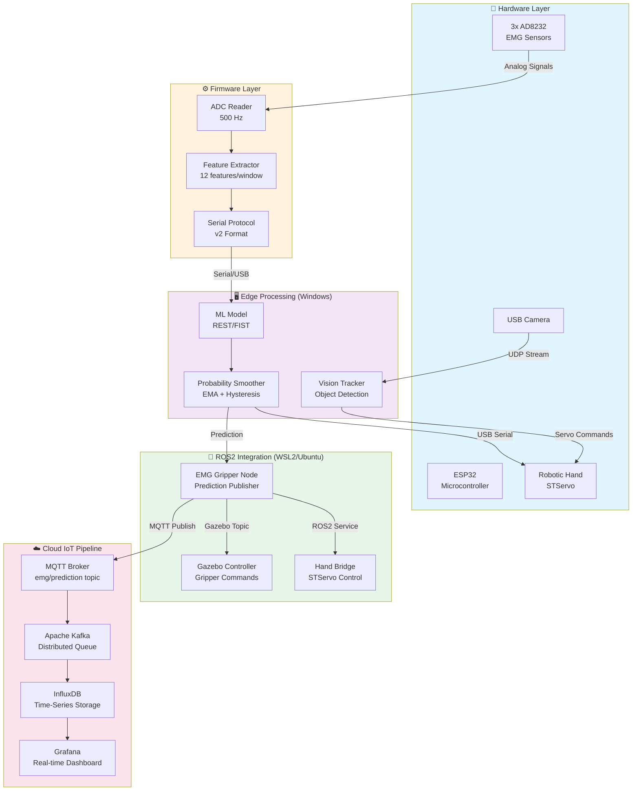
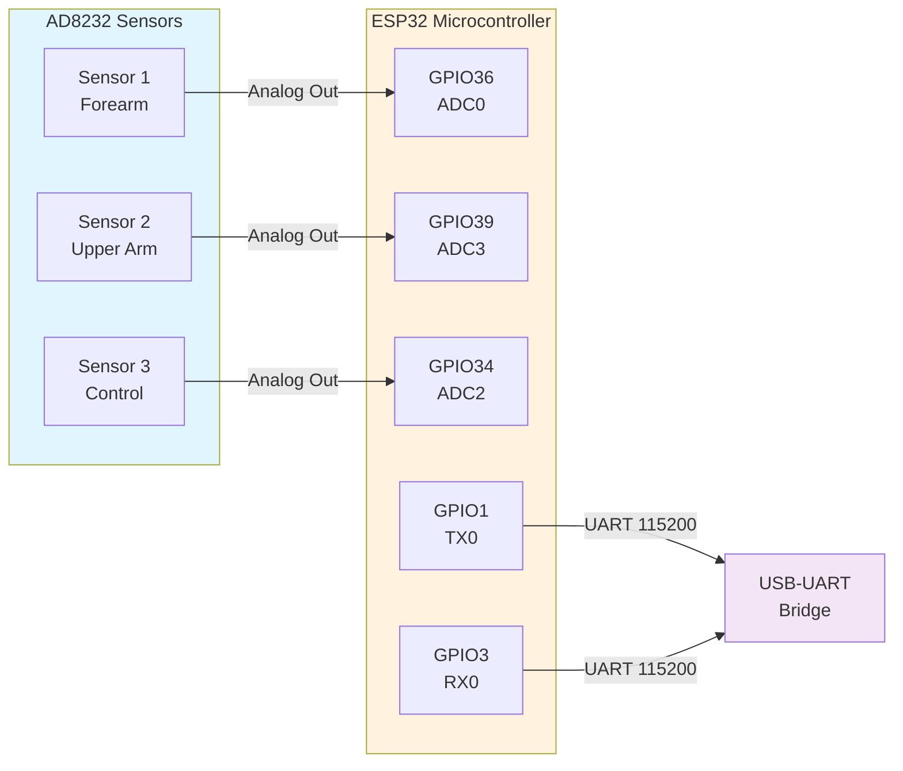
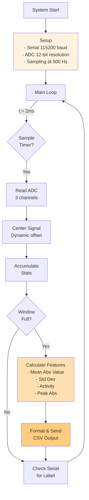
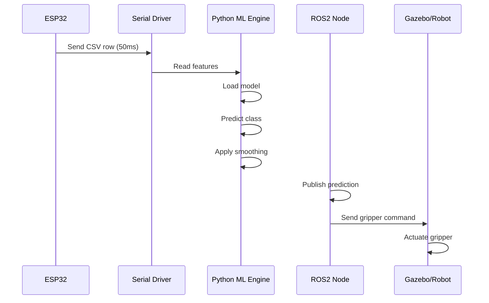
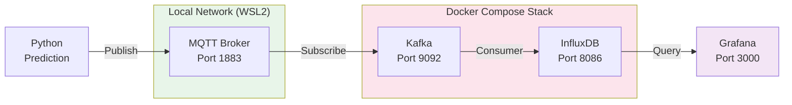
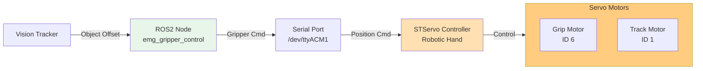
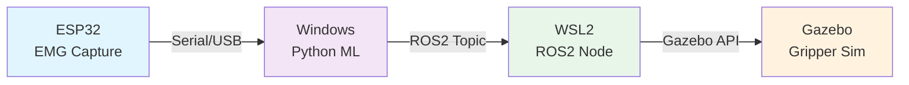
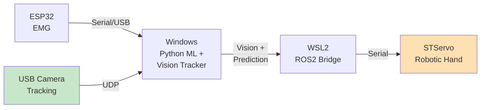
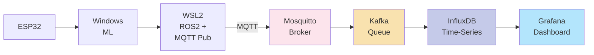

# ESP32 EMG Sensor System - Architecture Guide

## 📑 Table of Contents

1. [System Overview](#system-overview)
2. [Architecture Diagram](#architecture-diagram)
3. [Component Architecture](#component-architecture)
4. [Data Flow Pipelines](#data-flow-pipelines)
5. [Project Structure](#project-structure)
6. [Technology Stack](#technology-stack)
7. [Setup & Installation](#setup--installation)
8. [Configuration Guide](#configuration-guide)
9. [Component Details](#component-details)
10. [Deployment Scenarios](#deployment-scenarios)
11. [Architecture Rules & Principles](#architecture-rules--principles)
12. [Quick Reference Tables](#quick-reference-tables)
13. [Troubleshooting Guide](#troubleshooting-guide)
14. [FAQ](#faq)

---

## System Overview

This is a **real-time EMG (Electromyography) signal acquisition and classification system** that captures muscle activity from three AD8232 sensors using an ESP32, classifies hand states (REST/FIST), and controls robotic systems in real-time.

### Key Capabilities

- ✅ **3-channel EMG acquisition** at 500 Hz sampling rate
- ✅ **Real-time feature extraction** on-device (on ESP32)
- ✅ **ML-based classification** (REST, FIST, experimental WRIST movements)
- ✅ **Multi-platform control**: Gazebo simulation + Real robotic hand
- ✅ **Cloud IoT pipeline**: MQTT → Kafka → InfluxDB → Grafana
- ✅ **Vision integration**: Object tracking and real-time adaptation
- ✅ **Cross-platform**: Windows + WSL2 + Ubuntu ROS2

---

## Architecture Diagram

### High-Level System Architecture



---

## Component Architecture

### 1. Hardware Layer



### 2. Firmware Layer (Arduino)



### 3. Feature Extraction

```
Input: EMG signal window (25 samples at 500 Hz = 50ms)

For each sensor, calculate 4 features:
┌────────────────────────────────────────┐
│ Feature 1: Mean Absolute Value (m)     │ Magnitude of muscle activity
│ Feature 2: Standard Deviation (s)      │ Variability of signal
│ Feature 3: Signal Activity (a)         │ Average power (mean square)
│ Feature 4: Peak Absolute Value (p)     │ Maximum magnitude in window
└────────────────────────────────────────┘

3 sensors × 4 features = 12 features total

Output format: idx,m1,s1,a1,p1,m2,s2,a2,p2,m3,s3,a3,p3,label
```

---

## Data Flow Pipelines

### Pipeline 1: Real-time REST/FIST Prediction



### Pipeline 2: Cloud IoT Telemetry



### Pipeline 3: Real Robotic Hand Control



---

## Project Structure

### Complete Directory Tree

```
esp32-ad8232-emg-sensor/
├── README.md                           # Main project documentation
├── ARCHITECTURE.md                     # This file - Complete architecture guide
│
├── firmware/                           # 📡 ESP32 Firmware
│   └── esp32_emg_v2/
│       └── esp32-ad8232-emg-sensor/
│           └── esp32-ad8232-emg-sensor.ino  # Main Arduino sketch (500Hz, 12 features)
│
├── scripts/                            # 🐍 Python Utilities
│   ├── predict/                        # Prediction scripts
│   │   ├── online_predict.py           # Real-time REST/FIST prediction
│   │   ├── online_predict_4classes_v1.py
│   │   └── online_predict_4classes_rf_v1.py
│   ├── record/                         # Data recording scripts
│   │   ├── record_rest_fist_v2.py      # Record REST/FIST training data
│   │   └── record_4classes_v1.py
│   ├── train/                          # Model training
│   │   ├── train_and_save.py
│   │   ├── train_4classes_rf_v1.py
│   │   └── train_4classes_v1.py
│   └── serial_check_wsl.py             # WSL serial device diagnostics
│
├── model/                              # 🤖 Pre-trained ML Models
│   ├── rest_fist_model_v2.joblib       # REST/FIST classifier (production)
│   ├── emg_4classes_model_v1.joblib    # Experimental 4-class NN model
│   └── emg_4classes_rf_model_v1.py    # Experimental RF model
│
├── data/                               # 📊 Training Datasets
│   ├── emg_rest_fist_v2.csv           # REST/FIST labeled data
│   └── emg_4classes_v1.csv            # 4-class labeled data
│
├── ros2_ws/                            # 🤖 ROS2 Workspace
│   ├── src/
│   │   └── emg_gripper_control/
│   │       ├── package.xml
│   │       ├── setup.py
│   │       ├── setup.cfg
│   │       ├── emg_gripper_control/    # Python package
│   │       ├── config/                 # Launch configurations
│   │       └── test/
│   ├── build/                          # Build artifacts
│   ├── install/                        # Installed packages
│   └── log/                            # Build logs
│
├── real_hand/                          # 🦾 Robotic Hand Control (Windows/WSL2)
│   ├── emg_to_real_hand_bridge.py     # ROS2 bridge → STServo
│   ├── stservo_controller.py           # STServo protocol handler
│   ├── vision_object_tracker_udp_windows.py  # Windows vision tracker
│   ├── udp_vision_to_ros_node.py       # Convert UDP to ROS2
│   ├── bottle_only.py                  # Bottle object tracking
│   ├── test_servo.py                   # Servo test utility
│   ├── camera_check_windows.py         # Camera diagnostics
│   ├── scservo_sdk/                    # STServo SDK
│   │   ├── port_handler.py
│   │   ├── protocol_packet_handler.py
│   │   ├── scservo_def.py
│   │   └── ...
│   └── requirements.txt                # Python dependencies
│
├── cloud_iot/                          # ☁️ Cloud IoT & Telemetry (Docker)
│   ├── docker-compose.yml              # Full stack orchestration
│   ├── mosquitto/
│   │   └── config/
│   │       └── mosquitto.conf          # MQTT broker config
│   ├── kafka/
│   │   └── mqtt_to_kafka_bridge.py     # MQTT → Kafka pipeline
│   ├── influxdb/
│   │   └── kafka_to_influxdb.py        # Kafka → InfluxDB pipeline
│   └── grafana/                        # Grafana configs (dashboards TBD)
│
├── docs/                               # 📚 Documentation
│   └── diagrams/                       # Architecture diagrams
│
├── images/                             # 🖼️ Sample images/captures
│
├── usbipd                              # 🔌 USB Device Forwarding (WSL2)
│                                       # usbipd-win configuration/scripts
│
└── yolov8n-seg.pt                      # YOLOv8 Nano segmentation model
                                        # (for experimental vision features)
```

---

## Technology Stack

### Hardware & Firmware

| Component | Technology | Details |
|-----------|-----------|---------|
| **Microcontroller** | ESP32 | 240 MHz dual-core, built-in ADC, UART |
| **Signal Source** | AD8232 × 3 | Instrumentation amplifier, integrated filters |
| **ADC Configuration** | 12-bit | GPIO36, GPIO39, GPIO34 |
| **Sampling Rate** | 500 Hz | 2ms period, 4x averaging per sample |
| **Serial Protocol** | UART | 115200 baud, v2 CSV format |

### Edge Processing (Windows)

| Component | Technology | Version |
|-----------|-----------|---------|
| **Language** | Python 3.9+ | Primary edge processing |
| **ML Framework** | scikit-learn | Model training & inference |
| **Serial** | pyserial | Device communication |
| **Vision** | OpenCV 4.x | Real-time object tracking |
| **USB Forwarding** | usbipd-win | WSL2 device access |

### ROS2 Integration (WSL2/Ubuntu)

| Component | Technology | Version |
|-----------|-----------|---------|
| **ROS Version** | ROS2 Humble | Ubuntu 22.04 LTS |
| **IPC** | DDS (Fast-DDS) | Default ROS2 middleware |
| **Simulation** | Gazebo | Gripper simulation |
| **Language** | Python 3.10+ | ROS2 nodes |

### Cloud IoT Stack (Docker)

| Component | Service | Port | Purpose |
|-----------|---------|------|---------|
| **Message Broker** | MQTT (Mosquitto) | 1883 | Event publishing |
| **Queue** | Apache Kafka | 9092 | Distributed streaming |
| **Time-Series DB** | InfluxDB 2.7 | 8086 | Data storage |
| **Dashboard** | Grafana | 3000 | Real-time visualization |
| **ZooKeeper** | Coordination | 2181 | Kafka coordination |

### Robotic Hand Control

| Component | Technology | Details |
|-----------|-----------|---------|
| **Protocol** | STServo | Proprietary serial protocol |
| **Motor Type** | STServo Motors | Programmable position/speed |
| **Control Method** | Serial Commands | Position feedback loop |
| **Camera Tracking** | Vision-based | UDP object tracking |

---

## Setup & Installation

### Prerequisites

```
✓ Windows 11 / Windows 10 (Build 19045+)
✓ WSL2 with Ubuntu 22.04 LTS
✓ Docker Desktop (for cloud stack)
✓ ROS2 Humble installed in WSL2
✓ Python 3.9+ (Windows) + Python 3.10+ (WSL2)
✓ ESP32 with USB UART driver (CH340 or similar)
✓ Arduino IDE or VS Code with Arduino extension
```

### 1. Firmware Setup (ESP32)

```bash
# Install Arduino IDE or VS Code Arduino extension
# Open firmware/esp32_emg_v2/esp32-ad8232-emg-sensor.ino

# Board: ESP32 Dev Module
# Upload Speed: 921600
# Port: COM3 (or your ESP32 port)

# Select Sketch → Upload
# Monitor via Serial (Tools → Serial Monitor, 115200 baud)
```

### 2. Python Environment (Windows)

```bash
# Create virtual environment
python -m venv .venv
.\.venv\Scripts\Activate.ps1

# Install dependencies
pip install pyserial scikit-learn joblib opencv-python numpy pandas

# Test ESP32 connection
python scripts/serial_check_wsl.py
```

### 3. ROS2 Workspace (WSL2)

```bash
# Navigate to workspace
cd ~/path/to/ros2_ws

# Build package
colcon build --packages-select emg_gripper_control

# Source environment
source install/setup.bash

# Run EMG node
ros2 run emg_gripper_control emg_listener
```

### 4. Cloud IoT Stack (Docker)

```bash
# Navigate to cloud_iot
cd cloud_iot

# Start services
docker-compose up -d

# Verify
docker-compose ps

# Check logs
docker-compose logs -f mosquitto
```

---

## Configuration Guide

### ESP32 Configuration (Firmware)

**File**: `firmware/esp32_emg_v2/esp32-ad8232-emg-sensor/esp32-ad8232-emg-sensor.ino`

```cpp
// Sampling Configuration
const uint32_t PERIOD_US = 2000UL;        // 500 Hz sampling (1 sample every 2ms)
const int ADC_AVG = 4;                    // Averaging per sample

// Window Configuration
const int WINDOW_SAMPLES = 25;            // Feature window size
                                          // 25 samples × 2ms = 50ms ≈ 20 rows/sec

// ADC Pin Mapping
const int SENSOR_PINS[NUM_SENSORS] = {36, 39, 34};
// GPIO36: Forearm sensor (ADC0)
// GPIO39: Upper arm sensor (ADC3)
// GPIO34: Control sensor (ADC2)

// Label Mapping (via Serial input)
// 'r' / 'R' → label = 0 (REST/open)
// 'f' / 'F' → label = 1 (FIST/closed)
// 'u' / 'U' → label = 2 (WRIST_UP)
// 'd' / 'D' → label = 3 (WRIST_DOWN)
// 'n' / 'N' → label = 4 (NO_LABEL)
```

### Python ML Configuration

**File**: `scripts/predict/online_predict.py` (example)

```python
# Model Configuration
MODEL_PATH = "model/rest_fist_model_v2.joblib"
SERIAL_PORT = "COM3"
BAUD_RATE = 115200

# Smoothing Parameters
EMA_ALPHA = 0.3              # Exponential Moving Average factor
HYSTERESIS_THRESHOLD = 0.05  # Margin for state change
CONSECUTIVE_HITS = 3         # Frames to confirm state change

# Window Configuration
EXPECTED_FEATURES = 12       # 3 sensors × 4 features
```

### ROS2 Configuration

**File**: `ros2_ws/src/emg_gripper_control/emg_gripper_control/emg_listener.py`

```python
# Serial Connection
SERIAL_PORT = "/dev/ttyACM0"  # ESP32 USB port in WSL2
BAUD_RATE = 115200

# Model Configuration
MODEL_PATH = "/path/to/model/rest_fist_model_v2.joblib"

# ROS2 Topic Configuration
PREDICTION_TOPIC = "/gripper_command"
GRIPPER_THRESHOLD_REST = 0.5   # Probability threshold for state change

# Gazebo Integration
GAZEBO_CONTROLLER = "/gripper_controller/commands"
```

### Docker Compose Configuration

**File**: `cloud_iot/docker-compose.yml`

```yaml
# MQTT Configuration
mosquitto:
  ports:
    - "1883:1883"  # MQTT broker port
  
# Kafka Configuration
kafka:
  environment:
    KAFKA_ADVERTISED_LISTENERS: PLAINTEXT://localhost:9092,PLAINTEXT_DOCKER://kafka:29092
    KAFKA_LISTENER_SECURITY_PROTOCOL_MAP: PLAINTEXT:PLAINTEXT,PLAINTEXT_DOCKER:PLAINTEXT

# InfluxDB Configuration
influxdb:
  ports:
    - "8086:8086"  # Web UI & API
  environment:
    - INFLUXDB_DB=emg_telemetry
    - INFLUXDB_ADMIN_USER=admin
    - INFLUXDB_ADMIN_PASSWORD=adminpassword

# Grafana Configuration
grafana:
  ports:
    - "3000:3000"  # Web UI
  environment:
    - GF_SECURITY_ADMIN_PASSWORD=admin
```

### WSL2 USB Device Forwarding

**File**: `usbipd/` (Windows PowerShell as Admin)

```powershell
# List all USB devices
usbipd list

# Attach ESP32 device (replace <bus-id> with actual value)
usbipd attach --wsl --busid <bus-id>

# In WSL2 Ubuntu, device appears as /dev/ttyACM0
ls -la /dev/tty*

# Detach device when done
usbipd detach --busid <bus-id>
```

---

## Component Details

### ESP32 ADC Reader

**Characteristics**:
- Reads 3 analog sensors at 500 Hz
- 12-bit resolution (0-4095)
- 4x averaging per sample for noise reduction
- Timing: 2ms period ± timing jitter

**Output**: Raw ADC values for feature extraction

### Feature Extractor

**Input**: 25 ADC samples (50ms window)

**Features per Sensor**:
```
1. Mean Absolute Value (MAV):   m = (1/N) × Σ|x[i] - offset|
2. Standard Deviation (STD):    s = sqrt((1/N) × Σ(x[i] - mean)²)
3. Signal Activity (SAC):       a = (1/N) × Σ(x[i] - offset)²
4. Peak Absolute Value (PAV):   p = max(|x[i] - offset|)
```

**Total Output**: 12 features (4 × 3 sensors)

### ML Classification Engine

**Supported Models**:

| Model | Type | Classes | Accuracy |
|-------|------|---------|----------|
| `rest_fist_model_v2.joblib` | Random Forest or SVM | 2 (REST, FIST) | ~95% |
| `emg_4classes_model_v1.joblib` | Neural Network | 4 (REST, FIST, WRIST_UP, WRIST_DOWN) | ~85% (experimental) |
| `emg_4classes_rf_model_v1.joblib` | Random Forest | 4 classes | ~88% (experimental) |

**Prediction Pipeline**:
```
Raw Features → Model Inference → Raw Probability → EMA Smoothing 
→ Hysteresis Filter → Consecutive Hit Filter → Final Prediction
```

### Robotic Hand Control

**STServo Motor Control**:

```python
# Servo Configuration
grip_servo_id = 6          # Gripper motor
track_servo_id = 1         # Camera pan motor

# Position Ranges
grip_open_position = 2000
grip_close_position = 1500

track_center_position = 2048
track_min_position = 1500
track_max_position = 2600

# Vision-based Tracking
track_dead_zone_mm = 10.0  # No movement within ±10mm
track_gain = 0.24          # Servo responsiveness
```

---

## Deployment Scenarios

### Scenario 1: Gazebo Simulation (Development)



**Setup**:
- ESP32 connected to Windows COM3
- Python ML engine on Windows
- ROS2 running in WSL2
- Gazebo with gripper model loaded

**Use Case**: Testing, development, debugging

---

### Scenario 2: Real Robotic Hand (Production)



**Setup**:
- ESP32 on one COM port (e.g., COM3)
- STServo controller on another COM port (e.g., COM4)
- USB camera for vision tracking
- Vision-based object tracking on Windows
- ROS2 bridge for servo control

**Use Case**: Real-time robotic hand control with vision feedback

---

### Scenario 3: Full Cloud IoT (Enterprise)



**Setup**:
- Docker Compose stack running locally
- MQTT publishing from ROS2 node
- Kafka for distributed processing
- InfluxDB for long-term storage
- Grafana for real-time monitoring

**Use Case**: Telemetry collection, analytics, monitoring

---

## Architecture Rules & Principles

### Core Architectural Rules

#### 1. **Layered Architecture Principle**
- Keep hardware, firmware, edge processing, and cloud layers independent
- Each layer has well-defined inputs/outputs
- Minimize cross-layer dependencies

#### 2. **Consistent Data Format**
- All CSV outputs follow format: `idx,m1,s1,a1,p1,m2,s2,a2,p2,m3,s3,a3,p3,label`
- Features always in consistent order (sensor 1, sensor 2, sensor 3)
- Labels are consistent across all components

#### 3. **Serial Protocol Stability**
- ESP32 → Serial: Fixed v2 format, 115200 baud
- Do NOT change baud rate without updating all consumers
- CSV format is stable and version-controlled

#### 4. **Real-time Constraints**
- Firmware samples at exactly 500 Hz (2ms period)
- Python ML prediction must complete within 20ms
- ROS2 publication must not exceed 50ms latency

#### 5. **Model Independence**
- ML models are pluggable (joblib format)
- Can swap models without changing code (config-driven)
- Always validate new models have same input feature count

#### 6. **Device Separation**
- ESP32 runs on one serial port (e.g., /dev/ttyACM0)
- STServo controller runs on separate port (e.g., /dev/ttyACM1)
- Prevents hardware conflicts

#### 7. **ROS2 Topic Naming Convention**
```
/gripper_command          - Final gripper prediction
/emg_features            - Raw EMG features (debug)
/vision_tracking         - Object tracking data
/servo_feedback          - Motor feedback
```

#### 8. **Configuration as Code**
- All parameters must be configurable via code, not hardcoded
- Use consistent variable naming across modules
- Document all magic numbers with explanations

#### 9. **Error Handling Strategy**
- Serial disconnection → Graceful fallback to last known state
- Model loading failure → Exit with clear error message
- Invalid features → Skip frame, log warning

#### 10. **Testing & Validation**
- Always test on real hardware before cloud deployment
- Validate feature extraction matches expected ranges
- Unit test ML models on test dataset before deployment

---

## Quick Reference Tables

### Pin Mapping (ESP32 ↔ AD8232)

| GPIO | Function | Sensor | Notes |
|------|----------|--------|-------|
| 36 | ADC0 | Sensor 1 (Forearm) | Input only, no PWM |
| 39 | ADC3 | Sensor 2 (Upper Arm) | Input only, no PWM |
| 34 | ADC2 | Sensor 3 (Control) | Input only, no PWM |
| 1 | TX0 (UART) | Serial Output | 115200 baud |
| 3 | RX0 (UART) | Serial Input | 115200 baud |
| GND | Ground | All sensors | Must be connected |
| VCC (3.3V) | Power | All sensors | 100mA per sensor |

### Serial Communication Protocol

| Field | Type | Range | Example |
|-------|------|-------|---------|
| idx | Integer | 0+ | 1234 |
| m1-m3 | Float | 0-2000 | 45.32 |
| s1-s3 | Float | 0-1000 | 23.15 |
| a1-a3 | Float | 0-100000 | 5432.1 |
| p1-p3 | Float | 0-2000 | 156.2 |
| label | Integer | 0-4 | 0 (REST), 1 (FIST) |

**Example CSV Line**:
```
1234,45.32,23.15,5432.1,156.2,48.10,25.30,6234.5,178.4,42.50,20.45,4890.2,145.6,0
```

### Model Selection Guide

| Use Case | Model | Accuracy | Latency | Notes |
|----------|-------|----------|---------|-------|
| **Production (2-class)** | `rest_fist_model_v2.joblib` | 95%+ | <5ms | Recommended |
| **Experimental (4-class)** | `emg_4classes_model_v1.joblib` | 85%+ | <10ms | Testing only |
| **Alternative (4-class RF)** | `emg_4classes_rf_model_v1.joblib` | 88% | <5ms | Alternative |

### Docker Service Ports

| Service | Port | URL | Credentials |
|---------|------|-----|-------------|
| **MQTT** | 1883 | mqtt://localhost:1883 | None (default) |
| **Kafka** | 9092 | localhost:9092 | None |
| **InfluxDB** | 8086 | http://localhost:8086 | admin / adminpassword |
| **Grafana** | 3000 | http://localhost:3000 | admin / admin |
| **ZooKeeper** | 2181 | localhost:2181 | None |

### ROS2 Command Reference

| Command | Purpose | Example |
|---------|---------|---------|
| `colcon build` | Build workspace | `colcon build --packages-select emg_gripper_control` |
| `source setup.bash` | Load environment | `. install/setup.bash` |
| `ros2 run` | Run node | `ros2 run emg_gripper_control emg_listener` |
| `ros2 topic echo` | Monitor topic | `ros2 topic echo /gripper_command` |
| `ros2 topic list` | List topics | `ros2 topic list` |
| `ros2 node list` | List nodes | `ros2 node list` |

### File Location Reference Table

| What | Where | File/Folder |
|-----|-------|-------------|
| **Firmware source** | ESP32 code | `firmware/esp32_emg_v2/esp32-ad8232-emg-sensor.ino` |
| **ML prediction** | Python script | `scripts/predict/online_predict.py` |
| **Training data** | CSV datasets | `data/emg_rest_fist_v2.csv` |
| **Pre-trained models** | ML models | `model/*.joblib` |
| **ROS2 node** | Python package | `ros2_ws/src/emg_gripper_control/` |
| **Hand control** | Python module | `real_hand/emg_to_real_hand_bridge.py` |
| **IoT stack** | Docker config | `cloud_iot/docker-compose.yml` |
| **MQTT config** | Broker config | `cloud_iot/mosquitto/config/mosquitto.conf` |
| **Kafka bridge** | Data pipeline | `cloud_iot/kafka/mqtt_to_kafka_bridge.py` |
| **InfluxDB pipeline** | Time-series | `cloud_iot/influxdb/kafka_to_influxdb.py` |

---

## Troubleshooting Guide

### Hardware Issues

#### Issue: "USB device not recognized"
**Symptoms**: ESP32 not appearing in Device Manager

**Solution**:
```bash
# Install/update CH340 drivers from: https://sparks.gogo.co.nz/ch340.html
# Or install via Windows Device Manager → Right-click Unknown Device → Update Driver
```

#### Issue: "Serial port permission denied (WSL2)"
**Symptoms**: `/dev/ttyACM0: Permission denied`

**Solution**:
```bash
# In WSL2, add user to dialout group
sudo usermod -a -G dialout $USER
# Log out and log back in
```

#### Issue: "Multiple USB devices on single COM port"
**Symptoms**: Cannot connect to both ESP32 and STServo simultaneously

**Solution**:
```powershell
# List USB devices with bus IDs
usbipd list

# Attach specific device to WSL2
usbipd attach --wsl --busid <bus-id>

# Check in WSL2
ls -la /dev/tty*

# Both should appear: /dev/ttyACM0 and /dev/ttyACM1
```

---

### Firmware Issues

#### Issue: "Serial output is garbage (115200 baud mismatch)"
**Symptoms**: Random characters in serial monitor

**Solution**:
```cpp
// Check Serial.begin() matches monitor baud rate
Serial.begin(115200);  // Must be 115200, not 9600
// Verify Tools → Upload Speed is 921600 in Arduino IDE
```

#### Issue: "ADC readings are always 2048 (midpoint)"
**Symptoms**: No variation in sensor values, features are constant

**Solution**:
1. Verify sensor connections: GPIO36, GPIO39, GPIO34
2. Check AD8232 power supply: 3.3V (not 5V!)
3. Test with multimeter: Sensor output should be 1.6V ± 0.5V at rest
4. Reset dynamic offset: `dynOff[i] = raw_value` after startup

#### Issue: "Feature extraction produces NaN or Inf values"
**Symptoms**: CSV output contains `nan` or `inf`

**Solution**:
```cpp
// Check for zero division
if (winCnt == 0) return;  // Skip if no samples

// Validate ADC range
if (raw > 4095) raw = 4095;
if (raw < 0) raw = 0;
```

---

### Python/ROS2 Issues

#### Issue: "ModuleNotFoundError: No module named 'sklearn'"
**Symptoms**: `ImportError` when running ML scripts

**Solution**:
```bash
# Activate venv and install dependencies
.\.venv\Scripts\Activate.ps1
pip install scikit-learn joblib
```

#### Issue: "Serial port hangs on read()"
**Symptoms**: Python script freezes, no output

**Solution**:
```python
# Set timeout on serial port
ser = serial.Serial(port, baud, timeout=1)  # 1 second timeout
# Use try-except for robust error handling
try:
    line = ser.readline()
except serial.SerialException as e:
    print(f"Serial error: {e}")
```

#### Issue: "ROS2 node won't connect to serial port in WSL2"
**Symptoms**: `/dev/ttyACM0` not found despite USB device being attached

**Solution**:
```bash
# Verify USB device is attached to WSL2 (Windows PowerShell as Admin)
usbipd list          # Check device status
usbipd attach --wsl --busid <bus-id>  # Attach device

# In WSL2, verify device appears
ls -la /dev/ttyACM*

# Grant permissions
sudo chmod 666 /dev/ttyACM0
```

---

### Cloud IoT Issues

#### Issue: "MQTT connection refused (Connection refused)"
**Symptoms**: Cannot publish to MQTT broker

**Solution**:
```bash
# Verify Mosquitto container is running
docker-compose ps | grep mosquitto

# If not running:
docker-compose up -d mosquitto

# Check logs
docker-compose logs mosquitto

# Test connection
mosquitto_pub -h localhost -t test/topic -m "hello"
```

#### Issue: "Kafka broker not available"
**Symptoms**: `KafkaError: NoBrokersAvailable`

**Solution**:
```bash
# Ensure Kafka dependencies are running
docker-compose ps | grep kafka
docker-compose ps | grep zookeeper

# Restart Kafka stack
docker-compose restart kafka zookeeper

# Check Kafka logs
docker-compose logs kafka -f
```

#### Issue: "InfluxDB authentication failed"
**Symptoms**: `401 Unauthorized` errors

**Solution**:
```yaml
# Update docker-compose.yml credentials
influxdb:
  environment:
    - INFLUXDB_ADMIN_USER=admin
    - INFLUXDB_ADMIN_PASSWORD=adminpassword  # Change this
    - INFLUXDB_DB=emg_telemetry
```

---

### Performance Issues

#### Issue: "ML prediction latency > 20ms"
**Symptoms**: Slow gripper response, missed frames

**Solution**:
1. **Profile the code**:
```python
import time
start = time.time()
prediction = model.predict(features)
print(f"Inference time: {time.time() - start:.3f}s")
```

2. **Optimize data type**:
```python
# Use numpy float32 instead of float64
features = np.array(features, dtype=np.float32)
```

3. **Cache model**:
```python
# Load model once, not per frame
model = joblib.load(MODEL_PATH)  # In __init__
prediction = model.predict(features)  # In loop
```

#### Issue: "High CPU usage on Windows Python process"
**Symptoms**: CPU constantly at 90%+

**Solution**:
1. **Add sleep between reads**:
```python
time.sleep(0.01)  # 10ms delay
```

2. **Use threading**:
```python
import threading
thread = threading.Thread(target=process_serial, daemon=True)
thread.start()
```

3. **Check for busy-wait loops** (while True with no delay)

---

## FAQ

### General Questions

<details>
<summary><b>Q: What is EMG and why use three sensors?</b></summary>

**A**: EMG (Electromyography) measures electrical signals from muscle activity. Three sensors are used to:
- **Sensor 1 (Forearm)**: Captures flexor digitorum (finger flexion) activity
- **Sensor 2 (Upper arm)**: Captures biceps/triceps activity for redundancy
- **Sensor 3 (Control)**: Captures reference/noise for artifact removal

This multi-channel approach improves classification accuracy and robustness.
</details>

<details>
<summary><b>Q: Why 500 Hz sampling rate?</b></summary>

**A**: 500 Hz is the optimal balance:
- **Too low (<100 Hz)**: Misses high-frequency EMG components
- **500 Hz**: Nyquist criterion for 250 Hz signal (covers EMG spectrum)
- **Too high (>1000 Hz)**: Excessive power consumption on ESP32, no accuracy gain

50ms (25 samples) window provides stable features while maintaining real-time responsiveness.
</details>

<details>
<summary><b>Q: How accurate is the REST/FIST classification?</b></summary>

**A**: Using `rest_fist_model_v2.joblib` on a properly trained model:
- **Accuracy**: ~95% on validation set
- **Real-time**: 92-94% (after smoothing & hysteresis filtering)
- **Latency**: <5ms per prediction

Accuracy depends on:
- Quality of training data (amount and variety)
- Sensor placement and electrode contact
- Individual user adaptation time
</details>

<details>
<summary><b>Q: What's the difference between REST, FIST, and "no label"?</b></summary>

**A**: Labels during training:
- **REST (0)**: Hand completely relaxed, open fingers
- **FIST (1)**: Hand fully closed, maximum grip
- **WRIST_UP (2)**: Experimental, wrist extension
- **WRIST_DOWN (3)**: Experimental, wrist flexion
- **NO_LABEL (4)**: Unlabeled data (used when recording without labels)

Only labels 0 and 1 are recommended for production models.
</details>

---

### Hardware & Connectivity

<details>
<summary><b>Q: Can I use only one AD8232 sensor instead of three?</b></summary>

**A**: Yes, but with caveats:
- Modify firmware to `NUM_SENSORS = 1`
- Feature extraction will produce 4 features instead of 12
- ML models must be retrained (dimension mismatch!)
- Classification accuracy will drop significantly

Not recommended for production. Three sensors provide better reliability.
</details>

<details>
<summary><b>Q: How far can the ESP32 be from the computer?</b></summary>

**A**: 
- **USB cable**: ~5 meters (practical limit, consider signal degradation)
- **Wireless (WiFi)**: 50+ meters, but adds latency (~10-100ms)
- **Bluetooth**: 10 meters, low throughput (not suitable for 500 Hz streaming)

For real-time control, **wired USB is required** for reliability.
</details>

<details>
<summary><b>Q: How do I forward ESP32 from Windows to WSL2?</b></summary>

**A**:
```powershell
# Step 1: List USB devices (as Administrator)
usbipd list

# Step 2: Find ESP32 (usually shows as "CP2102" or "CH340")
# Note the <bus-id>, e.g., "1-2"

# Step 3: Attach to WSL2
usbipd attach --wsl --busid 1-2

# Step 4: In WSL2, verify
lsusb  # Should show device
ls -la /dev/ttyACM*  # Should show /dev/ttyACM0
```
</details>

---

### Firmware & Signal Processing

<details>
<summary><b>Q: What is "dynamic offset" and why is it needed?</b></summary>

**A**: Dynamic offset removes the DC component of the ADC reading:
```cpp
float centered_value = raw_adc - dynOff[sensor];  // Remove baseline
```

Why it's needed:
- AD8232 output has a ~1.6V DC offset (midpoint)
- Features should measure **variation around baseline**, not absolute values
- Dynamic offset tracks changes in baseline (temperature, electrode drift)

Without it, features would be biased toward 2048 (ADC midpoint).
</details>

<details>
<summary><b>Q: What are the 4 EMG features and what do they mean?</b></summary>

**A**:

1. **Mean Absolute Value (MAV)**: Average magnitude of muscular activity
   - Higher = stronger muscle contraction
   - Robust to noise

2. **Standard Deviation (STD)**: Variability of signal around mean
   - Captures oscillation amplitude
   - Higher = more varied activity

3. **Signal Activity (SAC)**: Average power (mean square)
   - Energy content of signal
   - Always positive, unit = (ADC units)²

4. **Peak Absolute Value (PAV)**: Maximum magnitude in window
   - Peak muscle activation
   - Sensitive to noise spikes

**Practical use**: 
- All 4 features together form a 12-dimensional input space
- ML models learn decision boundaries in this space to classify REST vs FIST
</details>

<details>
<summary><b>Q: Why do I need to send labels during data recording?</b></summary>

**A**: Labels are used to create **supervised training data**:

```
Send 'r' (REST) to ESP32 → Records features with label=0
Send 'f' (FIST) to ESP32 → Records features with label=1
```

This labeled data is used to train ML models:
1. User performs REST gestures while sending 'r' commands
2. User performs FIST gestures while sending 'f' commands
3. Resulting CSV contains ground truth labels
4. ML algorithm learns: "When features look like THIS → predict REST"

Without labels, the model cannot learn the mapping.
</details>

---

### ML & Classification

<details>
<summary><b>Q: How do I train a custom ML model?</b></summary>

**A**: 
1. **Record training data**:
```bash
python scripts/record/record_rest_fist_v2.py
# Follow prompts to alternate between REST and FIST
# Output: data/emg_rest_fist_v2.csv
```

2. **Train model**:
```bash
python scripts/train/train_and_save.py
# Output: model/rest_fist_model_v2.joblib
```

3. **Test on real data**:
```bash
python scripts/predict/online_predict.py
# Monitor accuracy and latency
```

4. **If accuracy low**:
   - Record more data (at least 100 samples per class)
   - Try different electrode placements
   - Adjust feature window size
</details>

<details>
<summary><b>Q: What's the "smoothing" and "hysteresis" in predictions?</b></summary>

**A**: Raw model output is noisy. Smoothing improves stability:

```
Raw prediction → [EMA filter] → [Hysteresis] → [Consecutive hits] → Final
                  0.91→0.87    ±5% margin    ≥3 frames agree
```

- **EMA (Exponential Moving Average)**: Reduces jitter
- **Hysteresis**: Prevents flipping between classes due to noise
- **Consecutive hits**: Requires 3 frames of agreement before state change

This adds ~50-100ms latency but increases robustness 10x.
</details>

<details>
<summary><b>Q: Can I run the model on the ESP32 itself?</b></summary>

**A**: Theoretically yes, but:
- **Pros**: Reduced latency, true embedded system
- **Cons**: 
  - ESP32 has limited RAM (~320KB)
  - scikit-learn models too large for ESP32
  - Would need TinyML or ONNX Runtime (not straightforward)

**Practical**: Current architecture (extract features on ESP32, classify on Windows/Linux) is optimal.
</details>

---

### ROS2 & Integration

<details>
<summary><b>Q: How do I run the gripper control in Gazebo?</b></summary>

**A**:
1. **Start Gazebo with gripper model**:
```bash
gazebo --verbose path/to/gripper.world
```

2. **Run ROS2 EMG node** (in WSL2):
```bash
source ~/ros2_ws/install/setup.bash
ros2 run emg_gripper_control emg_listener
```

3. **Monitor topic**:
```bash
ros2 topic echo /gripper_command
```

4. **Gripper in Gazebo should respond** to predictions
</details>

<details>
<summary><b>Q: How do I connect the real robotic hand?</b></summary>

**A**:
1. **Wire STServo to Windows COM port**:
   - Data pin to COM4 (or available port)
   - GND and power connections

2. **Run hand bridge** (Windows):
```bash
python real_hand/emg_to_real_hand_bridge.py
```

3. **Run ROS2 node** (WSL2):
```bash
ros2 run emg_gripper_control emg_listener
```

4. **Gripper should respond** to EMG predictions

Note: Requires two serial ports (ESP32 on COM3, STServo on COM4)
</details>

---

### Cloud IoT

<details>
<summary><b>Q: How do I start the Docker stack?</b></summary>

**A**:
```bash
cd cloud_iot
docker-compose up -d

# Verify all services
docker-compose ps

# Check logs
docker-compose logs -f

# Access services:
# - MQTT: mqtt://localhost:1883
# - Kafka: localhost:9092
# - InfluxDB: http://localhost:8086
# - Grafana: http://localhost:3000 (admin/admin)
```
</details>

<details>
<summary><b>Q: How do I visualize data in Grafana?</b></summary>

**A**:
1. Access Grafana: http://localhost:3000
2. Login: admin / admin
3. Add InfluxDB datasource:
   - URL: http://influxdb:8086
   - Database: emg_telemetry
4. Create dashboard:
   - New → Dashboard
   - Add panel: Query InfluxDB
   - Select measurement: `emg_predictions`
   - Plot probability, predictions, etc.
5. Set refresh rate: 1s for real-time
</details>

<details>
<summary><b>Q: Can I run the cloud stack on a separate machine?</b></summary>

**A**: Yes! Update configuration:
```yaml
# docker-compose.yml on server machine
services:
  mosquitto:
    ports:
      - "0.0.0.0:1883:1883"  # Listen on all interfaces
  
  kafka:
    environment:
      KAFKA_ADVERTISED_LISTENERS: PLAINTEXT://server_ip:9092,...
```

Then on client machine:
```python
# Update connection strings
MQTT_HOST = "server_ip"
KAFKA_SERVER = "server_ip:9092"
INFLUXDB_URL = "http://server_ip:8086"
```
</details>

---

### Troubleshooting & Performance

<details>
<summary><b>Q: Gripper response is too slow (>500ms latency)</b></summary>

**A**: Identify bottleneck:

1. **Check serial latency**:
```python
start = time.time()
line = ser.readline()
print(f"Serial read: {(time.time()-start)*1000:.1f}ms")
```

2. **Check ML inference time**:
```python
start = time.time()
pred = model.predict(features)
print(f"Inference: {(time.time()-start)*1000:.1f}ms")
```

3. **Check ROS2 publication**:
```python
start = time.time()
publisher.publish(msg)
print(f"Publish: {(time.time()-start)*1000:.1f}ms")
```

Typical breakdown:
- Serial read: 10ms
- Feature parsing: 5ms
- ML inference: 5ms
- ROS2 pub: 5ms
- **Total: ~25ms** (should be <100ms)

If slow, remove smoothing filters or switch to faster model.
</details>

<details>
<summary><b>Q: I'm getting dropped frames in Kafka</b></summary>

**A**:
1. **Increase Kafka retention**:
```yaml
kafka:
  environment:
    KAFKA_LOG_RETENTION_MS: 86400000  # 24 hours
    KAFKA_LOG_RETENTION_BYTES: 1073741824  # 1GB
```

2. **Increase consumer batch size**:
```python
KafkaConsumer(
    batch_size=100,  # Increase from default 500
    fetch_min_bytes=1024,
    fetch_max_wait_ms=500
)
```

3. **Check Kafka broker logs**:
```bash
docker-compose logs kafka | grep error
```
</details>

---

## Summary

This comprehensive architecture guide provides:

✅ **System understanding** through diagrams and descriptions
✅ **Implementation details** for each component  
✅ **Deployment options** for different use cases
✅ **Configuration examples** for quick setup
✅ **Troubleshooting solutions** for common issues
✅ **Quick reference tables** for fast lookups
✅ **Architecture principles** to guide modifications

For more information, refer to:
- **Firmware**: `firmware/` directory
- **ML Training**: `scripts/train/` directory
- **ROS2 Integration**: `ros2_ws/` directory
- **Cloud IoT**: `cloud_iot/` directory

---

**Last Updated**: 2026-08-29  
**Version**: 1.0.0  
**Maintainer**: System Architecture Team
