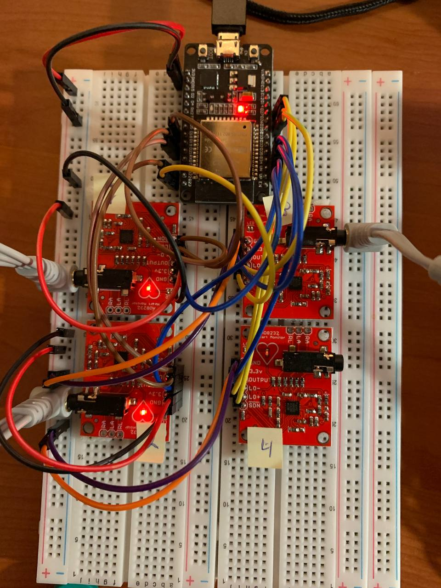
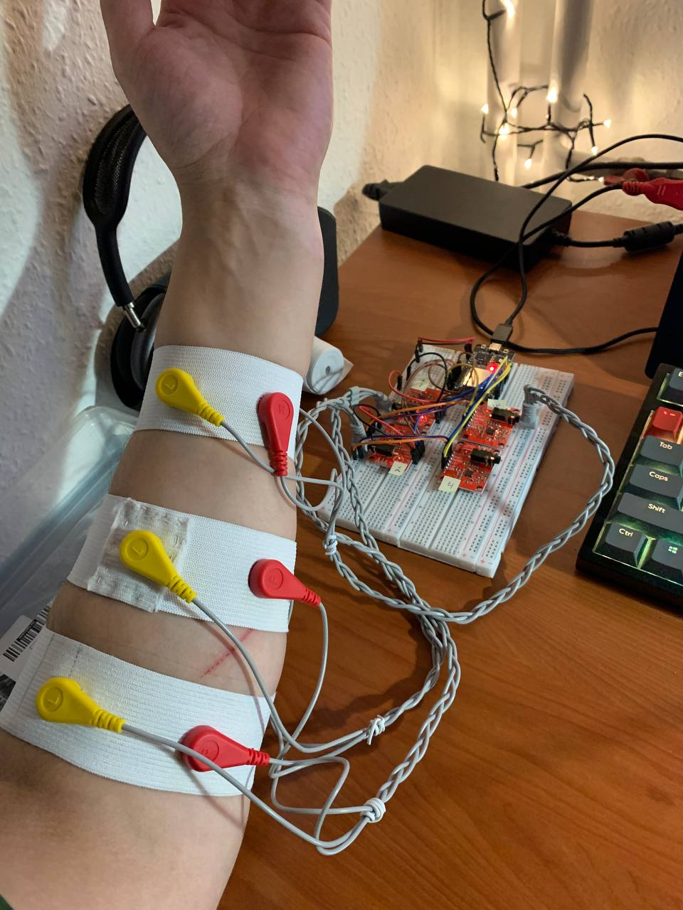

# ESP32 + AD8232 EMG Sensor Integration

This project implements an **EMG (Electromyography)** monitoring and control system using **three AD8232 sensors** and an **ESP32** microcontroller. While the AD8232 is traditionally used for ECG, this project applies digital signal processing to extract muscle activity data without hardware modifications.

The final system classifies two hand states — **REST** and **FIST** — and uses the prediction to control a simulated gripper in **Gazebo** through **ROS2**.

---

## Features

- **Three-channel EMG capture**: Reads analog EMG signals from three AD8232 modules using ESP32 ADC pins GPIO36, GPIO39, and GPIO34.
- **Real-time feature extraction**: Calculates EMG features directly on the ESP32.
- **v2 Serial output format**: Sends 12 EMG features plus label through Serial.
- **REST/FIST classification**: Uses a trained machine learning model to classify relaxed hand and closed fist.
- **Real-time prediction**: Applies probability smoothing, EMA, hysteresis, and consecutive-hit filtering.
- **ROS2 integration**: Publishes gripper commands from a ROS2 Python node.
- **Gazebo control**: Opens and closes a simulated gripper through `/gripper_controller/commands`.
- **WSL2 support**: ESP32 is forwarded from Windows to Ubuntu WSL2 using `usbipd-win`.
- **Lead-off detection pins reserved**: LO+/LO− pins are connected for all three sensors and can be used later to detect whether electrodes are properly attached.
- **MQTT streaming**: Publishes real-time REST/FIST prediction events to an MQTT broker.
- **Kafka pipeline**: Streams MQTT prediction events into Apache Kafka for scalable telemetry processing.
- **InfluxDB storage**: Stores prediction telemetry as time-series data.
- **Grafana dashboard**: Visualizes prediction probability, smoothed probability, gripper commands, and predicted labels.
- **Experimental four-class classification**: Tests REST, FIST, WRIST_UP, and WRIST_DOWN recognition as an experimental extension.

---

## Current Pipeline

The current stable v1.0 implementation demonstrates a full real-time EMG-to-Gazebo and Cloud IoT pipeline.

```text
ESP32 + 3x AD8232 EMG Sensors
        ↓
Feature Extraction on ESP32
        ↓
REST/FIST Machine Learning Classification
        ↓
ROS2 EMG Node
        ↓
Gazebo Gripper Control
        ↓
MQTT Streaming
        ↓
Kafka Streaming Pipeline
        ↓
InfluxDB Time-Series Storage
        ↓
Grafana Visualization
```

The system classifies two hand states:

| Class | Meaning | Gazebo Action |
| :--- | :--- | :--- |
| `0` | REST / relaxed hand | Open gripper |
| `1` | FIST / closed hand | Close gripper |

In the tested Gazebo gripper model:

| EMG State | Hand State | Gripper Command |
| :--- | :--- | :--- |
| REST | Open | `0.0` |
| FIST | Closed | `0.15` |

---

## Experimental Version 1.1 — Four-Class EMG Classification

After implementing the stable REST/FIST pipeline in version 1.0, an experimental four-class classifier was tested.

The additional movement classes are:

| Label | Class | Description |
| :--- | :--- | :--- |
| `0` | REST | Relaxed hand |
| `1` | FIST | Closed fist |
| `2` | WRIST_UP | Wrist extension |
| `3` | WRIST_DOWN | Wrist flexion |

The dataset structure remains unchanged because the input feature vector is still based on three EMG sensors and 12 extracted features:

```text
m1,s1,a1,p1,m2,s2,a2,p2,m3,s3,a3,p3,label
```
## Hardware Connections (ESP32 DevKit V1)

This project uses **three AD8232 modules** connected to one ESP32.  
Each AD8232 sensor has its own analog output pin and optional lead-off detection pins.

| AD8232 Pin | Sensor 1 → ESP32 | Sensor 2 → ESP32 | Sensor 3 → ESP32 | Logic/Function |
| :--- | :--- | :--- | :--- | :--- |
| **3.3V** | **3V3** | **3V3** | **3V3** | Power supply. Use strictly 3.3V |
| **GND** | **GND** | **GND** | **GND** | Common ground |
| **OUTPUT** | **GPIO36 (ADC1_CH0 / VP)** | **GPIO39 (ADC1_CH3 / VN)** | **GPIO34 (ADC1_CH6)** | Analog EMG signal |
| **LO+** | **GPIO19** | **GPIO21** | **GPIO23** | Lead-off detection + |
| **LO−** | **GPIO18** | **GPIO22** | **GPIO25** | Lead-off detection − |





### Demo Video
The video demonstrates the full real-time pipeline:

```text
EMG signal → ESP32 feature extraction → REST/FIST prediction → ROS2 → Gazebo gripper control
```
[Watch EMG REST/FIST to Gazebo gripper demo on YouTube](https://youtube.com/shorts/iMcEaw4SLKo?feature=share)

> **Important:** All three AD8232 modules must share the same **GND** with the ESP32.  
> The AD8232 modules must be powered from **3.3V**, not 5V.

> **Note:** If using a breadboard, ensure that the power rails (+ and -) are bridged between the top and bottom sections to provide consistent power to the ESP32 and all AD8232 modules.

---

## Electrode Placement

For optimal muscle sensing:

1. **Red/Yellow inputs**: Place along the target muscle fibers about 2–5 cm apart.
2. **Green/Black reference**: Place on a low-muscle-activity area, for example near the elbow or another bony area.
3. Keep electrode pressure as consistent as possible during recording.
4. Avoid changing the electrode position between dataset recording and real-time prediction.

---

## Software Configuration

| Parameter | Value |
| :--- | :--- |
| Baud rate | `115200` |
| ADC resolution | 12-bit, `0–4095` |
| Sampling frequency | 500 Hz |
| Sampling period | 2000 microseconds |
| Feature window | 25 samples |
| Window duration | 50 ms |
| Output rate | Approximately 20 rows/sec |

The ESP32 performs dynamic signal centering and extracts EMG features from each 50 ms window.

---

## EMG v2 Serial Output Format

The ESP32 calculates features from three EMG channels and sends them through Serial in CSV format.

The output format is:

```text
idx,m1,s1,a1,p1,m2,s2,a2,p2,m3,s3,a3,p3,label
```

This means:

```text
idx + 12 EMG features + label = 14 columns
```

For each sensor, four features are calculated over a 50 ms window:

| Feature | Meaning |
| :--- | :--- |
| `m` | Mean absolute value of the centered EMG signal |
| `s` | Standard deviation of the centered EMG signal |
| `a` | Signal activity / average power |
| `p` | Peak absolute value |

For three sensors, the feature columns are:

```text
m1,s1,a1,p1,
m2,s2,a2,p2,
m3,s3,a3,p3
```

The label is controlled through Serial commands:

| Serial Command | Label | Meaning |
| :--- | :--- | :--- |
| `r` | `0` | REST / relaxed hand |
| `f` | `1` | FIST / closed hand |
| `u` | `2` | WRIST_UP / wrist extension |
| `d` | `3` | WRIST_DOWN / wrist flexion |
| `n` | `4` | No active label |

Example Serial output:

```text
idx,m1,s1,a1,p1,m2,s2,a2,p2,m3,s3,a3,p3,label
577250,1525.079,1638.295,2767302.000,2137.239,1359.093,1511.993,2305317.750,2160.908,1723.205,1837.122,3401014.000,2170.949,2
```

---

## Dataset Recording

The dataset recorder reads Serial data from the ESP32 and saves a CSV file for training.

The dataset contains:

```text
m1,s1,a1,p1,m2,s2,a2,p2,m3,s3,a3,p3,label
```

The recorder automatically sends commands to the ESP32:

```text
r → REST
f → FIST
```
For the stable v1.0 version, the dataset file is:

```text
emg_rest_fist_v2.csv
```
For the experimental four-class version, a separate dataset is recorded:

```text
emg_4classes_v1.csv
```
The Python script trusts the command label from the recorder instead of relying on the ESP32 label.  
This helps avoid label errors caused by Serial timing delays.

```text
v1.0 = stable REST/FIST + Gazebo gripper
v1.1 = experimental 4-class recognition
```
### Dataset File

The expected dataset file is:

```text
emg_rest_fist_v2.csv
```

### Run Dataset Recording

```bash
python record_rest_fist_v2.py
```

Expected output:

```text
Cycle 1/10: REST / open hand
  captured: 48

Cycle 1/10: FIST / closed hand
  captured: 49

...

Saved: emg_rest_fist_v2.csv
Rows: 950
```

---

## Model Training

The model is trained on 12 EMG features:

```text
m1,s1,a1,p1,m2,s2,a2,p2,m3,s3,a3,p3
```

The current implementation uses:

- `StandardScaler`
- `LogisticRegression`
- train/test split
- accuracy score
- classification report
- confusion matrix

### Run Training

```bash
python train_rest_fist_v2.py
```

Expected output:

```text
Loaded: emg_rest_fist_v2.csv
Rows: 950

Label distribution:
0    475
1    475

Test accuracy: 0.98

Classification report:
...

Confusion matrix:
...

Saved: rest_fist_model_v2.joblib
```

The trained model is saved as:

```text
rest_fist_model_v2.joblib
```

---

## Real-Time Prediction

The real-time predictor reads live EMG features from ESP32 Serial and predicts:

```text
REST
FIST
```

The prediction is stabilized using:

| Parameter | Meaning |
| :--- | :--- |
| `ALPHA` | EMA smoothing factor |
| `TH_FIST` | Threshold for switching from REST to FIST |
| `TH_REST` | Threshold for switching from FIST to REST |
| `MIN_HITS` | Number of consecutive detections required to change state |

Current values:

```python
ALPHA = 0.2
TH_FIST = 0.62
TH_REST = 0.48
MIN_HITS = 3
```

### Run Real-Time Prediction

```bash
python online_predict_v2.py
```

Expected output:

```text
Model expects 12 features.
Expected v2 feature count: 12

Online REST/FIST prediction started.
Ctrl+C to stop.

REST | p_rest=0.931 | p_fist=0.069 | ema_fist=0.052 | hits=0
FIST | p_rest=0.103 | p_fist=0.897 | ema_fist=0.694 | hits=0
```

> **Important:** Before running real-time prediction, close Arduino Serial Monitor, Arduino Serial Plotter, and any other script using the same COM port.

---

# ROS2 + Gazebo Integration

This project includes real-time integration with **ROS2 Jazzy** and **Gazebo Sim** running inside **WSL2 Ubuntu 24.04**.

The complete pipeline is:

```text
ESP32 + 3x AD8232
→ EMG v2 feature extraction
→ REST/FIST machine learning model
→ ROS2 Python node
→ /gripper_controller/commands
→ Gazebo gripper open/close
```

---

## Tested Environment

| Component | Version / Setup |
| :--- | :--- |
| OS | Ubuntu 24.04 LTS inside WSL2 |
| ROS2 | Jazzy |
| Gazebo | Gazebo Sim 8 |
| ROS-Gazebo packages | `ros_gz` |
| Control packages | `ros2_control`, `ros2_controllers`, `gz_ros2_control` |
| Serial device | ESP32 connected to WSL2 as `/dev/ttyUSB0` |

---

## Required ROS2 Packages

Install the required ROS2 control packages:

```bash
sudo apt update
sudo apt install -y \
  ros-jazzy-ros2-control \
  ros-jazzy-ros2-controllers \
  ros-jazzy-gz-ros2-control \
  ros-jazzy-gz-ros2-control-demos
```

Check that the packages are available:

```bash
ros2 pkg list | grep control
```

Expected packages include:

```text
controller_manager
joint_state_broadcaster
joint_trajectory_controller
gripper_controllers
parallel_gripper_controller
gz_ros2_control
ros2_control
ros2_controllers
```

Check Gazebo ROS2 control:

```bash
ros2 pkg list | grep gz_ros2_control
```

Expected output:

```text
gz_ros2_control
```

---

## USB Forwarding from Windows to WSL2

The ESP32 is connected to Windows as a USB serial device, for example:

```text
Silicon Labs CP210x USB to UART Bridge (COM3)
```

To use it inside WSL2, forward the device using `usbipd-win`.

### Step 1: List USB Devices in Windows

Open **Windows PowerShell as Administrator** and run:

```powershell
usbipd list
```

Find the ESP32 device.

Example:

```text
BUSID  VID:PID    DEVICE
1-1    10c4:ea60  Silicon Labs CP210x USB to UART Bridge (COM3)
```

In this example, the BUSID is:

```text
1-1
```

### Step 2: Bind the USB Device

Because USBPcap may conflict with `usbipd`, use `--force`:

```powershell
usbipd bind --force --busid 1-1
```

### Step 3: Attach the USB Device to WSL2

```powershell
usbipd attach --wsl --busid 1-1
```

If several WSL distributions are installed, specify the distribution name:

```powershell
usbipd attach --wsl Ubuntu-24.04 --busid 1-1
```

### Step 4: Check the Device in WSL2

Inside Ubuntu WSL2, run:

```bash
ls /dev/ttyUSB* 2>/dev/null
ls /dev/ttyACM* 2>/dev/null
```

Expected result:

```text
/dev/ttyUSB0
```

### Step 5: Fix Serial Permissions if Needed

If access to `/dev/ttyUSB0` is denied, add the user to the `dialout` group:

```bash
sudo usermod -a -G dialout $USER
```

Then restart WSL from Windows PowerShell:

```powershell
wsl --shutdown
```

After restarting WSL, attach the device again:

```powershell
usbipd attach --wsl --busid 1-1
```

---

## Testing Serial Input in WSL2

Install `pyserial`:

```bash
python3 -m pip install pyserial --break-system-packages
```

Create a test script:

```bash
nano serial_check_wsl.py
```

Paste the following code:

```python
import serial
import time

PORT = "/dev/ttyUSB0"
BAUD = 115200

ser = serial.Serial(PORT, BAUD, timeout=1)
time.sleep(1.0)
ser.reset_input_buffer()

print(f"Reading from {PORT}...\n")

try:
    while True:
        line = ser.readline().decode(errors="ignore").strip()
        if line:
            print(line)
except KeyboardInterrupt:
    print("\nStopped.")
finally:
    ser.close()
```

Run:

```bash
python3 serial_check_wsl.py
```

Expected output:

```text
Reading from /dev/ttyUSB0...

577250,1525.079,1638.295,2767302.000,2137.239,1359.093,1511.993,2305317.750,2160.908,1723.205,1837.122,3401014.000,2170.949,2
577275,1549.204,1657.208,2825737.000,2138.334,1340.009,1493.198,2247715.750,2163.059,1701.826,1816.642,3327329.250,2170.889,2
```

This confirms that ESP32 is successfully available inside WSL2 as:

```text
/dev/ttyUSB0
```

> **Important:** Stop this script before running the ROS2 node. Only one program can read `/dev/ttyUSB0` at the same time.

---

## Gazebo Gripper Demo

Run the Gazebo gripper demo.

### Terminal 1: Start Gazebo

```bash
source /opt/ros/jazzy/setup.bash
ros2 launch gz_ros2_control_demos gripper_mimic_joint_example_position.launch.py
```

Leave this terminal running.

### Terminal 2: Check Controllers

Open another WSL2 terminal and run:

```bash
source /opt/ros/jazzy/setup.bash
ros2 control list_controllers
```

Expected output:

```text
gripper_controller      forward_command_controller/ForwardCommandController  active
joint_state_broadcaster joint_state_broadcaster/JointStateBroadcaster        active
```

### Check Gripper Topic

```bash
ros2 topic list | grep -i gripper
```

Expected output:

```text
/gripper_controller/commands
/gripper_controller/transition_event
```

Check the command topic type:

```bash
ros2 topic info /gripper_controller/commands
```

Expected output:

```text
Type: std_msgs/msg/Float64MultiArray
Publisher count: 0
Subscription count: 1
```

---

## Manual Gripper Control Test

The gripper can be controlled manually by publishing values to:

```text
/gripper_controller/commands
```

### Open Gripper

```bash
ros2 topic pub --once /gripper_controller/commands std_msgs/msg/Float64MultiArray "{data: [0.0]}"
```

### Close Gripper

```bash
ros2 topic pub --once /gripper_controller/commands std_msgs/msg/Float64MultiArray "{data: [0.15]}"
```

For this Gazebo gripper model:

```text
0.0  → open
0.15 → closed
```

---

## ROS2 EMG-to-Gripper Node

The ROS2 Python node reads EMG features from the ESP32, loads the trained machine learning model, predicts the current hand state, and publishes a gripper command to Gazebo.

The node performs:

```text
Serial read
→ parse 14-column v2 EMG data
→ extract 12 features
→ model.predict_proba()
→ EMA smoothing
→ hysteresis decision
→ publish Float64MultiArray command
```

Main configuration:

```python
PORT = "/dev/ttyUSB0"
MODEL_FILE = "rest_fist_model_v2.joblib"

CMD_TOPIC = "/gripper_controller/commands"

OPEN_VALUE = 0.0
CLOSE_VALUE = 0.15
```

Prediction stabilization:

```python
ALPHA = 0.2
TH_FIST = 0.62
TH_REST = 0.48
MIN_HITS = 3
```

Mapping:

| Prediction | Command Value | Gazebo Action |
| :--- | :--- | :--- |
| REST | `0.0` | Open gripper |
| FIST | `0.15` | Close gripper |

### Experimental ROS2 Four-Class Mode

The ROS2 node can also run in an experimental four-class mode using the Random Forest model:

```text
REST
FIST
WRIST_UP
WRIST_DOWN
---

This mode uses the model:
```text
emg_4classes_rf_model_v1.joblib
```
## Creating the ROS2 Workspace

The ROS2 workspace is now integrated directly into the main project structure.

Project root:

```bash
/mnt/d/Study/Sensormodalities/esp32-ad8232-emg-sensor
```

Create the ROS2 workspace structure:

```bash
cd "/mnt/d/Study/Sensormodalities/esp32-ad8232-emg-sensor"

mkdir -p ros2_ws/src
```

The ROS2 package should be placed inside:

```text
ros2_ws/src/emg_gripper_control
```

The workspace structure should look like this:

```text
esp32-ad8232-emg-sensor
├── ros2_ws
│   └── src
│       └── emg_gripper_control
├── model
├── data
├── firmware
├── scripts
└── cloud_iot
```

> **Note:** The ROS2 workspace should be created inside `ros2_ws`, not inside `/mnt/d/...`.  
> Building ROS2 packages is more stable and faster inside the Linux filesystem.

---

## Building the ROS2 Workspace

Install `colcon` if needed:

```bash
sudo apt install -y python3-colcon-common-extensions
```

Build the workspace:

```bash
cd "/mnt/d/Study/Sensormodalities/esp32-ad8232-emg-sensor/ros2_ws"

source /opt/ros/jazzy/setup.bash

colcon build

source install/setup.bash
```
---

## MQTT Integration

The ROS2 EMG node publishes gesture recognition events to an MQTT broker.

MQTT topic:

```text
emg/prediction
```

Example payload:

```json
{
  "prediction": "FIST",
  "label": 1,
  "command_value": 0.15,
  "p_rest": 0.03,
  "p_fist": 0.97,
  "ema_fist": 0.91,
  "timestamp": 1778349158.14
}
```

The MQTT layer is used as the first streaming stage for the Cloud IoT pipeline.

## Kafka Streaming Pipeline

The project includes a Kafka streaming layer for real-time telemetry transport.

Pipeline:

```text
ROS2 Node
→ MQTT Broker
→ MQTT-Kafka Bridge
→ Kafka Topic
```

Kafka topic:

```text
emg_predictions
```

The Kafka layer allows scalable streaming, buffering, and future analytics integration.

## InfluxDB Time-Series Storage

The project includes an InfluxDB consumer that reads prediction events from Kafka and stores them as time-series data.

Pipeline:

```text
Kafka Topic: emg_predictions
→ Kafka-InfluxDB Consumer
→ InfluxDB Bucket: emg-bucket
```

InfluxDB settings:

Parameter	Value
URL	http://localhost:8086
Organization	emg-org
Bucket	emg-bucket
Token	emg-token

The measurement used for prediction telemetry is:

emg_prediction

Stored fields include:

label
command_value
p_rest
p_fist
ema_fist
timestamp_source

The prediction class is stored as a tag:

prediction
Grafana Visualization

Grafana is used to visualize the real-time EMG prediction telemetry stored in InfluxDB.

Grafana URL:

http://localhost:3000

InfluxDB datasource settings in Grafana:

Setting	Value
Query language	Flux
URL	http://influxdb:8086
Organization	emg-org
Token	emg-token
Default bucket	emg-bucket

## Running the Cloud IoT Stack

Start the infrastructure:

```bash
docker compose -f cloud_iot/docker-compose.yml up -d
```

Verify running containers:

```bash
docker ps
```

```markdown
Expected services:

- Mosquitto MQTT broker
- Apache Kafka
- Apache ZooKeeper
- InfluxDB
- Grafana
```

## Running MQTT → Kafka Bridge

Start the bridge:

```bash
python3 cloud_iot/kafka/mqtt_to_kafka_bridge.py
```

Expected output:

```text
MQTT → Kafka bridge started.
Connected to MQTT broker.
Forwarded to Kafka topic: emg_predictions
```

## Kafka Consumer Test

Open Kafka consumer:

```bash
docker exec -it kafka bash
```

Inside the container:

```bash
kafka-console-consumer \
--bootstrap-server localhost:9092 \
--topic emg_predictions \
--from-beginning
```

Expected output:

```json
{"prediction":"FIST", ...}
{"prediction":"REST", ...}
```

## Running the Complete System

### Terminal 1: Start Gazebo Gripper Demo

```bash
source /opt/ros/jazzy/setup.bash

ros2 launch gz_ros2_control_demos gripper_mimic_joint_example_position.launch.py
```

---

### Terminal 2: Start Cloud IoT Infrastructure

```bash
cd "/mnt/d/Study/Sensormodalities/esp32-ad8232-emg-sensor"

docker compose -f cloud_iot/docker-compose.yml up -d
```

Expected services:

- Mosquitto MQTT broker
- Apache Kafka
- Apache ZooKeeper

---

### Terminal 3: Start MQTT Listener (optional debug)

```bash
cd "/mnt/d/Study/Sensormodalities/esp32-ad8232-emg-sensor"

python3 cloud_iot/mqtt/listener.py
```

Expected output:

```text
Received: {"prediction":"FIST", ...}
```

---

### Terminal 4: Start MQTT → Kafka Bridge

```bash
cd "/mnt/d/Study/Sensormodalities/esp32-ad8232-emg-sensor"

python3 cloud_iot/kafka/mqtt_to_kafka_bridge.py
```

Expected output:

```text
MQTT → Kafka bridge started.
Forwarded to Kafka topic: emg_predictions
```

---

### Terminal 5: Start Kafka → InfluxDB Consumer

```bash
cd "/mnt/d/Study/Sensormodalities/esp32-ad8232-emg-sensor"

python3 cloud_iot/influxdb/kafka_to_influxdb.py
```
```text
Expected output:

Kafka → InfluxDB consumer started.
Waiting for Kafka messages...
Written to InfluxDB: prediction=FIST, label=1, ...
```

### Terminal 6: Start the EMG ROS2 Node

```bash
cd "/mnt/d/Study/Sensormodalities/esp32-ad8232-emg-sensor/ros2_ws"

source /opt/ros/jazzy/setup.bash

source install/setup.bash

ros2 run emg_gripper_control emg_to_gripper
```

Expected node output:

```text
Loaded model: rest_fist_model_v2.joblib
Model expects 12 features.
Publishing to: /gripper_controller/commands
Opened serial port: /dev/ttyUSB0
MQTT connected: localhost:1883
```

```markdown
For the experimental four-class ROS2 mode, the node loads:
```
```text
emg_4classes_rf_model_v1.joblib
```

### Terminal 7: Open Grafana Dashboard

Open Grafana in the browser:

```text
http://localhost:3000
---

## Common Issues

### COM Port or Serial Device Is Busy

Only one program can read the ESP32 Serial port at a time.

Before running the ROS2 node, close:

- Arduino Serial Monitor
- Arduino Serial Plotter
- `serial_check_wsl.py`
- standalone `online_predict.py`
- dataset recording scripts

---

### `/dev/ttyUSB0` Disappeared

After restarting WSL, reconnecting the ESP32, or restarting Windows, the USB device may need to be attached again.

In Windows PowerShell as Administrator:

```powershell
usbipd list
usbipd attach --wsl --busid 1-1
```

Then check again in WSL2:

```bash
ls /dev/ttyUSB* 2>/dev/null
ls /dev/ttyACM* 2>/dev/null
```

---

### Permission Denied for `/dev/ttyUSB0`

Add the user to the `dialout` group:

```bash
sudo usermod -a -G dialout $USER
```

Restart WSL:

```powershell
wsl --shutdown
```

Then attach the USB device again:

```powershell
usbipd attach --wsl --busid 1-1
```

---

### ROS2 Controller Manager Is Not Available

If this command waits forever:

```bash
ros2 control list_controllers
```

It usually means the Gazebo gripper demo is not running.

Start Gazebo first:

```bash
source /opt/ros/jazzy/setup.bash
ros2 launch gz_ros2_control_demos gripper_mimic_joint_example_position.launch.py
```

Then run:

```bash
ros2 control list_controllers
```

---

## Final System Summary

The final system was tested in **WSL2 Ubuntu 24.04** with **ROS2 Jazzy** and **Gazebo Sim 8**.

The ESP32 was forwarded from Windows to WSL2 using `usbipd-win` and became available as:

```text
/dev/ttyUSB0
```

A ROS2 Python node reads real-time EMG features from the serial port, applies the trained REST/FIST classifier, stabilizes the prediction using EMA, hysteresis, and `MIN_HITS`, and publishes a `Float64MultiArray` command to:

```text
/gripper_controller/commands
```

In the tested Gazebo gripper model:

```text
0.0  → open gripper
0.15 → close gripper
```
```markdown
The stable v1.0 pipeline also streams prediction events to the Cloud IoT stack:

```text
ROS2 Node
→ MQTT Broker
→ MQTT-Kafka Bridge
→ Kafka Topic: emg_predictions
→ Kafka-InfluxDB Consumer
→ InfluxDB Bucket: emg-bucket
→ Grafana Dashboard
```
---
## License

MIT License