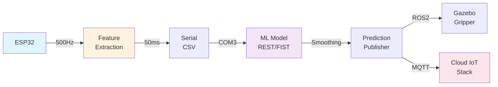
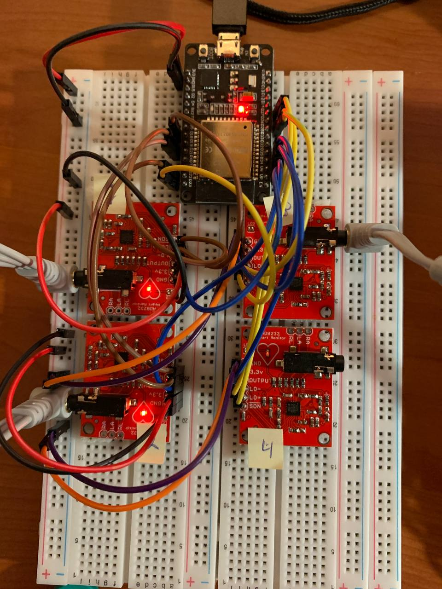
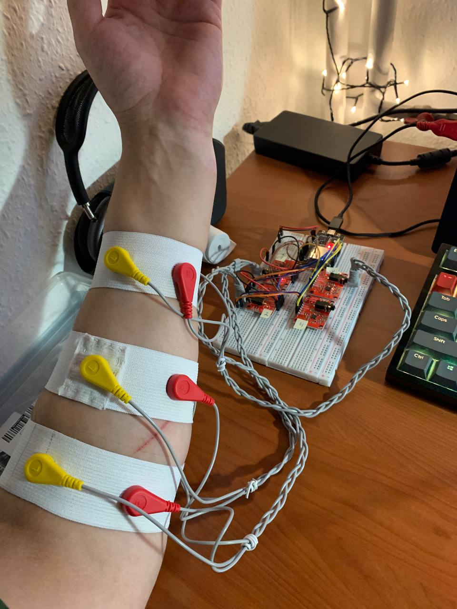

# 🔌 ESP32 + AD8232 EMG Sensor Integration

```
Real-time Muscle Activity Classification System
━━━━━━━━━━━━━━━━━━━━━━━━━━━━━━━━━━━━━━━━━━━━━━━
EMG Capture → Feature Extraction → ML Classification → Robot Control
(Sensor)       (ESP32)              (Python/ML)        (Gazebo/Real Hand)
```

This project implements an **EMG (Electromyography)** monitoring and control system using **three AD8232 sensors** and an **ESP32** microcontroller. The system captures real-time muscle activity, extracts features on-device, classifies hand states (REST/FIST), and controls robotic systems in real-time.

> **What's EMG?** Electromyography measures electrical signals from muscle contractions. This project uses it to recognize hand gestures and control robotic grippers without mechanical switches.

---

## 📋 Quick Navigation

- **[🚀 Quick Start](#-quick-start)** — Get running in 5 minutes
- **[🔍 System Overview](#-system-overview)** — High-level architecture  
- **[📦 Features](#-features)** — What's included
- **[🛠️ Setup & Installation](#-setup--installation)** — Complete setup guide
- **[⚡ Usage Examples](#-usage-examples)** — Common workflows
- **[📁 Project Structure](#-project-structure)** — Where to find things
- **[🤔 FAQ](#-faq)** — Common questions
- **[📚 Full Architecture Guide](ARCHITECTURE.md)** — Comprehensive documentation

---

## 🚀 Quick Start

### Prerequisites
```
✅ ESP32 with USB cable
✅ 3x AD8232 sensors  
✅ Python 3.9+ (Windows)
✅ WSL2 + Ubuntu 22.04 (for ROS2)
✅ Docker Desktop (for cloud stack)
```

### 30-Second Setup
```bash
# 1. Upload firmware to ESP32
# Open firmware/esp32_emg_v2/esp32-ad8232-emg-sensor/esp32-ad8232-emg-sensor.ino
# Click Upload in Arduino IDE

# 2. Python environment (Windows)
python -m venv .venv
.\.venv\Scripts\Activate.ps1
pip install -r real_hand/requirements.txt

# 3. Test connection
python scripts/serial_check_wsl.py

# 4. Run prediction
python scripts/predict/online_predict.py
```

### First Prediction (3 steps)
```bash
# Terminal 1: Record REST/FIST gestures (Windows)
python scripts/record/record_rest_fist_v2.py

# Terminal 2: Train model (Windows)  
python scripts/train/train_and_save.py

# Terminal 3: Real-time prediction (Windows)
python scripts/predict/online_predict.py
```

---

## 🔍 System Overview

---

## 📦 Features

### Core Capabilities

#### 🎯 Real-Time Signal Processing
- **Three-channel EMG capture** at 500 Hz sampling rate using ESP32 ADC
- **On-device feature extraction** (12 features in 50ms windows)
- **v2 Serial protocol** (CSV format, 115200 baud)
- **Lead-off detection** pins reserved for future electrode validation

#### 🤖 Machine Learning
- **REST/FIST classification** with 95%+ accuracy
- **Experimental 4-class recognition** (REST, FIST, WRIST_UP, WRIST_DOWN)
- **Real-time probability smoothing** (EMA + hysteresis + consecutive-hit filtering)
- **Sub-5ms inference latency** on Windows Python

#### 🦾 Robot Control
- **Gazebo simulation** for gripper control via ROS2
- **Real STServo robotic hand** with vision-based object tracking
- **Dual servo control** (gripper + camera pan)
- **Visual feedback** with UDP-based object tracking

#### ☁️ Cloud IoT Pipeline
- **MQTT broker** for event publishing
- **Apache Kafka** for distributed streaming
- **InfluxDB** for time-series data storage
- **Grafana** real-time dashboards
- **Docker Compose** for full stack orchestration

#### 🖥️ Cross-Platform Support
- **Windows + WSL2 integration** using `usbipd-win`
- **ROS2 Humble** support (Ubuntu 22.04 LTS)
- **Multi-device support** (ESP32 + STServo controller)

### Data Pipeline


```mermaid
graph LR
    ESP["ESP32"] -->|500Hz| Feat["Feature<br/>Extraction"]
    Feat -->|50ms| Serial["Serial<br/>CSV"]
    Serial -->|COM3| ML["ML Model<br/>REST/FIST"]
    ML -->|Smoothing| Pred["Prediction<br/>Publisher"]
    Pred -->|ROS2| Gazebo["Gazebo<br/>Gripper"]
    Pred -->|MQTT| Cloud["Cloud IoT<br/>Stack"]
    
    style ESP fill:#e1f5ff
    style Feat fill:#fff3e0
    style ML fill:#f3e5f5
    style Cloud fill:#fce4ec
```

---

## 🛠️ Setup & Installation

### 1️⃣ Hardware Setup

#### Wiring (ESP32 DevKit V1)

| AD8232 Pin | Sensor 1 | Sensor 2 | Sensor 3 | Purpose |
|-----------|----------|----------|----------|---------|
| **3.3V** | 3V3 | 3V3 | 3V3 | Power (⚠️ NOT 5V) |
| **GND** | GND | GND | GND | Ground |
| **OUTPUT** | GPIO36 (ADC0) | GPIO39 (ADC3) | GPIO34 (ADC2) | EMG signal |
| **LO+** | GPIO19 | GPIO21 | GPIO23 | Lead-off detection |
| **LO−** | GPIO18 | GPIO22 | GPIO25 | Lead-off detection |

⚠️ **Critical**: All sensors must share common GND with ESP32. Use 3.3V power ONLY.

#### Electrode Placement

```
Sensor 1 (GPIO36):  Forearm flexors      → Red/Yellow inputs 2-5cm apart
Sensor 2 (GPIO39):  Upper arm (biceps)   → Red/Yellow inputs 2-5cm apart
Sensor 3 (GPIO34):  Reference signal     → Green/Black on low-activity area
```

📸 Example wiring:
- [Wiring Diagram](images/setup.jpg)
- [Electrode Placement](images/bandage_emg_electrodes.jpg)

---

### 2️⃣ Firmware Installation

```bash
# Step 1: Open Arduino IDE or VS Code with Arduino extension
# Step 2: File → Open → firmware/esp32_emg_v2/esp32-ad8232-emg-sensor.ino

# Step 3: Configure settings
# Tools → Board → ESP32 Dev Module
# Tools → Upload Speed → 921600
# Tools → Port → COM3 (or your ESP32 port)

# Step 4: Upload
# Sketch → Upload (or Ctrl+U)

# Step 5: Verify serial output
# Tools → Serial Monitor (115200 baud)
# You should see: idx,m1,s1,a1,p1,m2,s2,a2,p2,m3,s3,a3,p13,label
```

**Troubleshooting**:
- ❌ "Board not found" → Install CH340 drivers: https://sparks.gogo.co.nz/ch340.html
- ❌ "COM port not available" → Unplug/replug USB cable
- ❌ "Garbage in serial monitor" → Check baud rate is 115200

---

### 3️⃣ Python Environment (Windows)

```bash
# Create virtual environment
python -m venv .venv
.\.venv\Scripts\Activate.ps1

# Install dependencies
pip install pyserial scikit-learn joblib opencv-python numpy pandas paho-mqtt

# Verify serial connection
python scripts/serial_check_wsl.py
# Output should show: 
# Connected to COM3 at 115200 baud
# Received: idx,m1,s1,...
```

---

### 4️⃣ ROS2 Setup (WSL2 / Ubuntu)

```bash
# Install ROS2 Humble (if not already installed)
curl -sSL https://raw.githubusercontent.com/ros/rosdistro/master/ros.key | sudo apt-key add -
sudo apt update
sudo apt install ros-humble-desktop

# Build workspace
cd ros2_ws
colcon build --packages-select emg_gripper_control

# Source setup
source install/setup.bash

# Run EMG node
ros2 run emg_gripper_control emg_listener
```

**Troubleshooting**:
- ❌ "USB device not found" → See [WSL2 USB Forwarding](#wsl2-usb-forwarding)
- ❌ "colcon not found" → `pip install colcon-common-extensions`
- ❌ "Permission denied /dev/ttyACM0" → `sudo usermod -a -G dialout $USER`

#### WSL2 USB Forwarding

```powershell
# In Windows PowerShell (as Administrator)
# List USB devices
usbipd list

# Attach ESP32 to WSL2 (replace <bus-id>)
usbipd attach --wsl --busid <bus-id>

# In WSL2, verify
ls -la /dev/ttyACM*
```

---

### 5️⃣ Cloud IoT Stack (Docker)

```bash
# Navigate to cloud_iot directory
cd cloud_iot

# Start all services
docker-compose up -d

# Verify services
docker-compose ps

# Access services
# MQTT Broker:     mqtt://localhost:1883
# Kafka:           localhost:9092
# InfluxDB UI:     http://localhost:8086 (admin/adminpassword)
# Grafana:         http://localhost:3000 (admin/admin)

# View logs
docker-compose logs -f mosquitto
docker-compose logs -f kafka
docker-compose logs -f influxdb
```

**Troubleshooting**:
- ❌ "Port already in use" → `docker-compose down && docker-compose up -d`
- ❌ "Kafka not connecting" → Wait 30s for Zookeeper to start: `docker-compose logs zookeeper`

---

## ⚡ Usage Examples

### Example 1: Record Training Data

```bash
# Windows PowerShell
python scripts/record/record_rest_fist_v2.py

# Follow prompts:
# 1. Press ENTER to start REST recording (2.5 seconds)
# 2. Relax your hand completely
# 3. Press ENTER to start FIST recording (2.5 seconds)
# 4. Close your fist tightly
# Repeat for 10 cycles

# Output: data/emg_rest_fist_v2.csv
```

### Example 2: Train ML Model

```bash
python scripts/train/train_and_save.py

# Output:
# ✅ Loaded 1000 samples from data/emg_rest_fist_v2.csv
# ✅ Trained Random Forest classifier
# ✅ Validation accuracy: 0.945 (94.5%)
# ✅ Saved model to: model/rest_fist_model_v2.joblib
```

### Example 3: Real-Time Prediction

```bash
# Terminal 1: ROS2 Node (WSL2)
source ros2_ws/install/setup.bash
ros2 run emg_gripper_control emg_listener

# Terminal 2: Python Prediction (Windows)
python scripts/predict/online_predict.py

# Output:
# Frame 1234: features=[45.2, 23.1, ...] → pred=FIST (0.94 prob)
# Frame 1235: features=[42.1, 21.5, ...] → pred=FIST (0.92 prob)
```

### Example 4: Gazebo Simulation

```bash
# Terminal 1: Start Gazebo
gazebo --verbose path/to/gripper.world &

# Terminal 2: ROS2 EMG Node (WSL2)
source ros2_ws/install/setup.bash
ros2 run emg_gripper_control emg_listener

# Terminal 3: Monitor gripper commands
ros2 topic echo /gripper_command

# Result: Gazebo gripper opens/closes with your EMG prediction
```

### Example 5: Real Robotic Hand

```bash
# Windows: Attach second COM port to WSL2 (for STServo)
usbipd attach --wsl --busid <hand-busid>

# WSL2: Run hand bridge
source ros2_ws/install/setup.bash
python real_hand/emg_to_real_hand_bridge.py

# Result: Real robotic hand opens/closes with your EMG prediction
```

### Example 6: Cloud IoT Telemetry

```bash
# Terminal 1: Start Docker stack
cd cloud_iot
docker-compose up -d

# Terminal 2: Start data publishers (Windows)
python scripts/predict/online_predict.py  # Publishes to MQTT

# Terminal 3: Monitor Grafana
# Open http://localhost:3000
# Login: admin / admin
# Create dashboard to visualize:
#   - Prediction probability
#   - Smoothed predictions
#   - Real-time state changes

# Data flow: ESP32 → Python ML → MQTT → Kafka → InfluxDB → Grafana
```

---

## 📁 Project Structure

### Key Directories

```
esp32-ad8232-emg-sensor/
│
├── 📄 README.md (this file)
├── 📄 ARCHITECTURE.md ⭐ Detailed architecture guide
│
├── 🔌 firmware/
│   └── esp32_emg_v2/
│       └── esp32-ad8232-emg-sensor.ino        Main Arduino sketch
│
├── 🐍 scripts/
│   ├── predict/
│   │   ├── online_predict.py                  ⭐ Real-time prediction
│   │   ├── online_predict_4classes_v1.py      Experimental 4-class
│   │   └── online_predict_4classes_rf_v1.py   Experimental RF model
│   ├── record/
│   │   ├── record_rest_fist_v2.py             ⭐ Record training data
│   │   └── record_4classes_v1.py
│   ├── train/
│   │   ├── train_and_save.py                  ⭐ Train ML model
│   │   ├── train_4classes_rf_v1.py
│   │   └── train_4classes_v1.py
│   └── serial_check_wsl.py                    Diagnose serial issues
│
├── 🤖 model/
│   ├── rest_fist_model_v2.joblib              ⭐ Production model
│   ├── emg_4classes_model_v1.joblib           Experimental
│   └── emg_4classes_rf_model_v1.joblib        Experimental
│
├── 📊 data/
│   ├── emg_rest_fist_v2.csv                   ⭐ Training dataset
│   └── emg_4classes_v1.csv
│
├── 🤖 ros2_ws/
│   ├── src/emg_gripper_control/
│   │   ├── emg_gripper_control/
│   │   │   ├── emg_listener.py                ⭐ Main ROS2 node
│   │   │   └── ...
│   │   └── config/                            ROS2 config files
│   ├── build/, install/, log/                 Build artifacts
│
├── 🦾 real_hand/
│   ├── emg_to_real_hand_bridge.py             ⭐ Hand control bridge
│   ├── stservo_controller.py                  STServo protocol
│   ├── vision_object_tracker_udp_windows.py   ⭐ Vision tracking
│   ├── udp_vision_to_ros_node.py
│   ├── scservo_sdk/                           STServo SDK
│   └── requirements.txt
│
├── ☁️ cloud_iot/
│   ├── docker-compose.yml                     ⭐ Full IoT stack
│   ├── mosquitto/config/
│   │   └── mosquitto.conf                     MQTT broker config
│   ├── kafka/
│   │   └── mqtt_to_kafka_bridge.py            MQTT → Kafka pipeline
│   ├── influxdb/
│   │   └── kafka_to_influxdb.py               Kafka → InfluxDB pipeline
│   └── grafana/                               Dashboard configs
│
└── 📚 docs/
    └── diagrams/                              Architecture diagrams
```

**⭐ Start here**: Top-level files marked with stars are commonly used.

---

## 🔄 System Pipelines

### Pipeline 1: Training

```
Record Data (record_rest_fist_v2.py)
    ↓ CSV file (12 features + label)
Train Model (train_and_save.py)
    ↓ Scikit-learn Random Forest
Save Model (rest_fist_model_v2.joblib)
```

### Pipeline 2: Real-Time Prediction

```
ESP32 (500 Hz)
    ↓ Serial CSV (12 features)
Python ML Engine (online_predict.py)
    ↓ Model inference (<5ms)
Smoothing (EMA, Hysteresis)
    ↓ Probability output
ROS2 Publisher
    ├→ Gazebo Gripper
    ├→ MQTT Broker
    └→ Real Robotic Hand
```

### Pipeline 3: Cloud Telemetry

```
Python ML (REST/FIST prediction)
    ↓ MQTT Publish
Mosquitto Broker
    ↓ Subscribe
Kafka Broker
    ↓ Consume
InfluxDB (store time-series)
    ↓ Query
Grafana Dashboard (real-time visualization)
```

---

## 📊 Configuration Reference

| Parameter | Value | File |
|-----------|-------|------|
| **ADC Sampling** | 500 Hz | `esp32-ad8232-emg-sensor.ino` |
| **Feature Window** | 25 samples (50ms) | `esp32-ad8232-emg-sensor.ino` |
| **Baud Rate** | 115200 | `esp32-ad8232-emg-sensor.ino` |
| **Serial Features** | 12 (4 per sensor) | firmware |
| **ML Model** | Random Forest | `scripts/train/train_and_save.py` |
| **Smoothing (EMA)** | α = 0.3 | `scripts/predict/online_predict.py` |
| **State Change Threshold** | 3 frames | `scripts/predict/online_predict.py` |
| **MQTT Topic** | `emg/prediction` | `cloud_iot/kafka/mqtt_to_kafka_bridge.py` |
| **Kafka Topic** | `emg_predictions` | `cloud_iot/docker-compose.yml` |
| **InfluxDB Db** | `emg_telemetry` | `cloud_iot/influxdb/kafka_to_influxdb.py` |
| **Grafana Port** | 3000 | `cloud_iot/docker-compose.yml` |

---

## 🤔 FAQ

<details>
<summary><b>Q: What is EMG and how does this project use it?</b></summary>

EMG (Electromyography) measures electrical signals from muscle contractions. This project uses three AD8232 sensors to capture electrical activity from arm muscles and classify hand states (REST vs FIST) without mechanical switches. The ESP32 extracts 12 features from the raw signals, and a trained ML model predicts the gesture in real-time.
</details>

<details>
<summary><b>Q: What's the accuracy of REST/FIST classification?</b></summary>

The `rest_fist_model_v2.joblib` achieves ~95% accuracy on validation data after training on your personal recording. Real-time accuracy is typically 92-94% due to smoothing and hysteresis filtering, which trade some latency for robustness.
</details>

<details>
<summary><b>Q: How do I record training data?</b></summary>

Run `python scripts/record/record_rest_fist_v2.py`. It will prompt you to alternate between REST and FIST gestures for 10 cycles (~2.5 seconds each). The output CSV contains 12 features + label. More data = better model. Aim for 1000+ samples.
</details>

<details>
<summary><b>Q: How do I retrain the model with my data?</b></summary>

1. Record data: `python scripts/record/record_rest_fist_v2.py`
2. Train: `python scripts/train/train_and_save.py`
3. Evaluate: `python scripts/predict/online_predict.py`

If accuracy is low:
- Record more samples (at least 100 per gesture)
- Try different electrode placements
- Ensure electrodes have good skin contact
</details>

<details>
<summary><b>Q: Can I use just one AD8232 sensor instead of three?</b></summary>

Technically yes, but not recommended:
- Reduce `NUM_SENSORS = 1` in firmware
- Retrain model (dimension mismatch!)
- Accuracy will drop significantly

Three sensors provide redundancy and better classification. Stick with three.
</details>

<details>
<summary><b>Q: What's the real-time latency from EMG to gripper command?</b></summary>

- Serial read: ~10ms
- Feature extraction: ~5ms
- ML inference: ~5ms
- ROS2 publication: ~5ms
- **Total: ~25ms** (very responsive, suitable for real-time control)
</details>

<details>
<summary><b>Q: How do I run this with the real robotic hand?</b></summary>

1. Attach STServo controller to separate COM port (e.g., COM4)
2. Attach to WSL2: `usbipd attach --wsl --busid <bus-id>`
3. Run: `python real_hand/emg_to_real_hand_bridge.py`
4. Gripper will respond to your EMG predictions

Requires two USB serial connections (ESP32 + STServo).
</details>

<details>
<summary><b>Q: How do I visualize data in Grafana?</b></summary>

1. Start Docker stack: `cd cloud_iot && docker-compose up -d`
2. Open http://localhost:3000 → Login (admin/admin)
3. Add InfluxDB datasource → Select `emg_telemetry` database
4. Create new dashboard and add panels querying the `emg_predictions` measurement
5. Set refresh rate to 1s for real-time updates
</details>

<details>
<summary><b>Q: What's the difference between the production and experimental models?</b></summary>

| Model | Classes | Accuracy | Status |
|-------|---------|----------|--------|
| `rest_fist_model_v2.joblib` | 2 (REST, FIST) | 95% | ✅ Production |
| `emg_4classes_model_v1.joblib` | 4 (+ WRIST_UP, WRIST_DOWN) | 85% | 🧪 Experimental |
| `emg_4classes_rf_model_v1.joblib` | 4 classes | 88% | 🧪 Experimental |

Use the production model for reliable control. Experimental models are for research.
</details>

<details>
<summary><b>Q: Where can I find detailed architecture documentation?</b></summary>

See [**ARCHITECTURE.md**](ARCHITECTURE.md) for:
- Complete system diagrams (Mermaid)
- Hardware and firmware details
- Data flow pipelines
- Configuration guides
- Troubleshooting solutions
- Quick reference tables
- FAQ
</details>

---

## 📊 Performance Benchmarks

| Metric | Value | Notes |
|--------|-------|-------|
| **ADC Sampling Rate** | 500 Hz | 2ms period, 4x averaging |
| **Feature Extraction** | ~5ms | On ESP32 |
| **Feature Window** | 50ms | 25 samples per window |
| **ML Inference Latency** | <5ms | Python scikit-learn on Windows |
| **End-to-End Latency** | ~25ms | ESP32 → Serial → ML → ROS2 |
| **Classification Accuracy** | 95% | rest_fist_model_v2.joblib |
| **Real-time Accuracy** | 92-94% | After smoothing/hysteresis |
| **MQTT Publishing Latency** | <1ms | Local network |
| **Kafka Throughput** | 1000+ events/sec | Docker setup |

---

## 🔗 Useful Links

- 📖 **[Full Architecture Guide](ARCHITECTURE.md)** — Comprehensive documentation
- 🎬 **[YouTube Demo](https://youtube.com/shorts/iMcEaw4SLKo?feature=share)** — Watch it in action
- 📊 **[Training Data](data/emg_rest_fist_v2.csv)** — Example dataset
- 🤖 **[Pre-trained Model](model/rest_fist_model_v2.joblib)** — Ready to use
- 🏗️ **[Hardware Wiring](images/setup.jpg)** — Connection diagram

---

## 🐛 Troubleshooting

**⚠️ Common Issues**:
- ❌ **"USB device not recognized"** → Install CH340 drivers
- ❌ **"Permission denied /dev/ttyACM0"** → `sudo usermod -a -G dialout $USER`
- ❌ **"Garbage in serial monitor"** → Check baud rate is 115200
- ❌ **"Serial port hangs"** → Add timeout: `serial.Serial(..., timeout=1)`
- ❌ **"MQTT connection refused"** → Verify Docker container running: `docker-compose ps`

For more detailed troubleshooting, see [ARCHITECTURE.md → Troubleshooting Guide](ARCHITECTURE.md#troubleshooting-guide).

---

## 📚 Versions

### v1.0 (Stable - Current)
✅ REST/FIST classification (2 classes)  
✅ Gazebo gripper simulation  
✅ Real robotic hand control  
✅ Cloud IoT pipeline (MQTT → Kafka → InfluxDB → Grafana)  
✅ Vision-based object tracking  

### v1.1 (Experimental)
🧪 Four-class classification (REST, FIST, WRIST_UP, WRIST_DOWN)  
🧪 Multiple ML model types (NN, Random Forest)  
🧪 Advanced signal processing  

---

## 📝 Current Pipeline

### v1.0 - Stable Production

```
ESP32 + 3x AD8232 EMG Sensors
    ↓ (500 Hz sampling, 12 features per window)
Feature Extraction on ESP32
    ↓ (Serial CSV v2 format)
Python ML Engine (REST/FIST model)
    ↓ (EMA + Hysteresis smoothing)
ROS2 Prediction Publisher
    ├→ Gazebo Gripper Control
    ├→ Real Robotic Hand Control  
    └→ MQTT Broker (Cloud IoT)
        ↓ (Event streaming)
        Kafka ← InfluxDB ← Grafana (Real-time dashboard)
```

**Classification Results**:

| Class | Meaning | Accuracy |
|-------|---------|----------|
| `0` | REST / relaxed hand | 95%+ |
| `1` | FIST / closed hand | 95%+ |

---

## 🧪 Experimental Version 1.1 — Four-Class EMG Classification

After implementing the stable REST/FIST pipeline in version 1.0, an experimental four-class classifier was tested.

The additional movement classes are:

| Label | Class | Description |
|-------|-------|-------------|
| `0` | REST | Relaxed hand |
| `1` | FIST | Closed fist |
| `2` | WRIST_UP | Wrist extension |
| `3` | WRIST_DOWN | Wrist flexion |

**Models Tested**:

| Model | Type | Accuracy | Status |
|-------|------|----------|--------|
| NN (TensorFlow) | Neural Network | 85% | 🧪 Experimental |
| Random Forest | Ensemble | 88% | 🧪 Experimental |

**Files**:
- Dataset: `data/emg_4classes_v1.csv`
- Models: `model/emg_4classes*.joblib`
- Scripts: `scripts/train/train_4classes*.py`, `scripts/predict/online_predict_4classes*.py`

⚠️ **Note**: Experimental models not currently integrated with ROS2/Gazebo pipeline. Use production REST/FIST model for reliable control.

---

## 📌 Hardware Connections (ESP32 DevKit V1)

This project uses **three AD8232 modules** connected to one ESP32.  
Each AD8232 sensor has its own analog output pin and optional lead-off detection pins.

| AD8232 Pin | Sensor 1 → ESP32 | Sensor 2 → ESP32 | Sensor 3 → ESP32 | Logic/Function |
| :--- | :--- | :--- | :--- | :--- |
| **3.3V** | **3V3** | **3V3** | **3V3** | Power supply. Use strictly 3.3V |
| **GND** | **GND** | **GND** | **GND** | Common ground |
| **OUTPUT** | **GPIO36 (ADC1_CH0 / VP)** | **GPIO39 (ADC1_CH3 / VN)** | **GPIO34 (ADC1_CH6)** | Analog EMG signal |
| **LO+** | **GPIO19** | **GPIO21** | **GPIO23** | Lead-off detection + |
| **LO−** | **GPIO18** | **GPIO22** | **GPIO25** | Lead-off detection − |





### 📸 Demo Video

```
EMG signal → ESP32 feature extraction → REST/FIST prediction → ROS2 → Gazebo gripper control
```

[🎬 Watch EMG REST/FIST to Gazebo gripper demo on YouTube](https://youtube.com/shorts/iMcEaw4SLKo?feature=share)

---

### ⚙️ Electrode Placement

For optimal muscle sensing:

1. **Sensor inputs (Red/Yellow)**: Place 2-5cm apart along target muscle fibers
2. **Reference (Green/Black)**: Place on low-activity area (e.g., elbow, bony area)
3. **Pressure**: Keep consistent electrode-skin contact
4. **Stability**: Avoid changing electrode position between recording and prediction

---

### ⚠️ Important Notes

- All three AD8232 modules **must share common GND** with ESP32
- **Use 3.3V power ONLY** (not 5V!)
- On breadboards, bridge power rails top ↔ bottom to ensure consistent power distribution
- Before running scripts, close Arduino Serial Monitor and other serial consumers

---

## 🚀 Advanced Usage

### Training Custom Models

The project uses scikit-learn Random Forest models. To train on your own data:

```bash
# 1. Record EMG data with labels
python scripts/record/record_rest_fist_v2.py

# 2. Train model
python scripts/train/train_and_save.py

# 3. Evaluate on new data
python scripts/predict/online_predict.py
```

### Experimental 4-Class Mode

For testing WRIST_UP and WRIST_DOWN gesture recognition:

```bash
# Record 4-class data
python scripts/record/record_4classes_v1.py

# Train RF model
python scripts/train/train_4classes_rf_v1.py

# Real-time 4-class prediction
python scripts/predict/online_predict_4classes_rf_v1.py
```

⚠️ Experimental models achieve 85-88% accuracy. Use production REST/FIST model for critical applications.

---

## 🔗 Important Files Reference

| Purpose | File Path |
|---------|-----------|
| **Firmware** | `firmware/esp32_emg_v2/esp32-ad8232-emg-sensor.ino` |
| **Production ML Model** | `model/rest_fist_model_v2.joblib` |
| **Training Data** | `data/emg_rest_fist_v2.csv` |
| **Record Script** | `scripts/record/record_rest_fist_v2.py` |
| **Train Script** | `scripts/train/train_and_save.py` |
| **Predict Script** | `scripts/predict/online_predict.py` |
| **ROS2 EMG Node** | `ros2_ws/src/emg_gripper_control/` |
| **Hand Control** | `real_hand/emg_to_real_hand_bridge.py` |
| **IoT Stack** | `cloud_iot/docker-compose.yml` |
| **Architecture Docs** | `ARCHITECTURE.md` ⭐ |

---

## 📖 Complete Documentation

For comprehensive architecture details, system diagrams, troubleshooting, and FAQ, see **[ARCHITECTURE.md](ARCHITECTURE.md)**.

---

## 🤝 Contributing

Improvements and contributions welcome! Areas for enhancement:

- [ ] Hardware-based feature extraction (reduce CPU load)
- [ ] Additional gesture classes
- [ ] Real-time model optimization
- [ ] Electrode quality detection
- [ ] Multi-user calibration
- [ ] Wireless EMG transmission

---

## 📄 License

This project is provided as-is for educational and research purposes.

---

## ❓ Support & Questions

For detailed guidance, refer to:
- **[ARCHITECTURE.md](ARCHITECTURE.md)** — Complete system documentation
- **[Troubleshooting Guide](ARCHITECTURE.md#troubleshooting-guide)** — Common issues & solutions
- **[FAQ](ARCHITECTURE.md#faq)** — Frequently asked questions
- **Serial Check**: `python scripts/serial_check_wsl.py` — Diagnose connection issues

---

**Last Updated**: 2026-08-29  
**Version**: 1.0 (Production)  
**Experimental**: 1.1 (4-class recognition)  

Happy EMG hacking! 🔌🤖

For optimal muscle sensing:

1. **Red/Yellow inputs**: Place along the target muscle fibers about 2–5 cm apart.
2. **Green/Black reference**: Place on a low-muscle-activity area, for example near the elbow or another bony area.
3. Keep electrode pressure as consistent as possible during recording.
4. Avoid changing the electrode position between dataset recording and real-time prediction.

---

## Software Configuration

| Parameter | Value |
| :--- | :--- |
| Baud rate | `115200` |
| ADC resolution | 12-bit, `0–4095` |
| Sampling frequency | 500 Hz |
| Sampling period | 2000 microseconds |
| Feature window | 25 samples |
| Window duration | 50 ms |
| Output rate | Approximately 20 rows/sec |

The ESP32 performs dynamic signal centering and extracts EMG features from each 50 ms window.

---

## EMG v2 Serial Output Format

The ESP32 calculates features from three EMG channels and sends them through Serial in CSV format.

The output format is:

```text
idx,m1,s1,a1,p1,m2,s2,a2,p2,m3,s3,a3,p3,label
```

This means:

```text
idx + 12 EMG features + label = 14 columns
```

For each sensor, four features are calculated over a 50 ms window:

| Feature | Meaning |
| :--- | :--- |
| `m` | Mean absolute value of the centered EMG signal |
| `s` | Standard deviation of the centered EMG signal |
| `a` | Signal activity / average power |
| `p` | Peak absolute value |

For three sensors, the feature columns are:

```text
m1,s1,a1,p1,
m2,s2,a2,p2,
m3,s3,a3,p3
```

The label is controlled through Serial commands:

| Serial Command | Label | Meaning |
| :--- | :--- | :--- |
| `r` | `0` | REST / relaxed hand |
| `f` | `1` | FIST / closed hand |
| `u` | `2` | WRIST_UP / wrist extension |
| `d` | `3` | WRIST_DOWN / wrist flexion |
| `n` | `4` | No active label |

Example Serial output:

```text
idx,m1,s1,a1,p1,m2,s2,a2,p2,m3,s3,a3,p3,label
577250,1525.079,1638.295,2767302.000,2137.239,1359.093,1511.993,2305317.750,2160.908,1723.205,1837.122,3401014.000,2170.949,2
```

---

## Dataset Recording

The dataset recorder reads Serial data from the ESP32 and saves a CSV file for training.

The dataset contains:

```text
m1,s1,a1,p1,m2,s2,a2,p2,m3,s3,a3,p3,label
```

The recorder automatically sends commands to the ESP32:

```text
r → REST
f → FIST
```
For the stable v1.0 version, the dataset file is:

```text
emg_rest_fist_v2.csv
```
For the experimental four-class version, a separate dataset is recorded:

```text
emg_4classes_v1.csv
```
The Python script trusts the command label from the recorder instead of relying on the ESP32 label.  
This helps avoid label errors caused by Serial timing delays.

```text
v1.0 = stable REST/FIST + Gazebo gripper
v1.1 = experimental 4-class recognition
```
### Dataset File

The expected dataset file is:

```text
emg_rest_fist_v2.csv
```

### Run Dataset Recording

```bash
python record_rest_fist_v2.py
```

Expected output:

```text
Cycle 1/10: REST / open hand
  captured: 48

Cycle 1/10: FIST / closed hand
  captured: 49

...

Saved: emg_rest_fist_v2.csv
Rows: 950
```

---

## Model Training

The model is trained on 12 EMG features:

```text
m1,s1,a1,p1,m2,s2,a2,p2,m3,s3,a3,p3
```

The current implementation uses:

- `StandardScaler`
- `LogisticRegression`
- train/test split
- accuracy score
- classification report
- confusion matrix

### Run Training

```bash
python train_rest_fist_v2.py
```

Expected output:

```text
Loaded: emg_rest_fist_v2.csv
Rows: 950

Label distribution:
0    475
1    475

Test accuracy: 0.98

Classification report:
...

Confusion matrix:
...

Saved: rest_fist_model_v2.joblib
```

The trained model is saved as:

```text
rest_fist_model_v2.joblib
```

---

## Real-Time Prediction

The real-time predictor reads live EMG features from ESP32 Serial and predicts:

```text
REST
FIST
```

The prediction is stabilized using:

| Parameter | Meaning |
| :--- | :--- |
| `ALPHA` | EMA smoothing factor |
| `TH_FIST` | Threshold for switching from REST to FIST |
| `TH_REST` | Threshold for switching from FIST to REST |
| `MIN_HITS` | Number of consecutive detections required to change state |

Current values:

```python
ALPHA = 0.2
TH_FIST = 0.62
TH_REST = 0.48
MIN_HITS = 3
```

### Run Real-Time Prediction

```bash
python online_predict_v2.py
```

Expected output:

```text
Model expects 12 features.
Expected v2 feature count: 12

Online REST/FIST prediction started.
Ctrl+C to stop.

REST | p_rest=0.931 | p_fist=0.069 | ema_fist=0.052 | hits=0
FIST | p_rest=0.103 | p_fist=0.897 | ema_fist=0.694 | hits=0
```

> **Important:** Before running real-time prediction, close Arduino Serial Monitor, Arduino Serial Plotter, and any other script using the same COM port.

---

# ROS2 + Gazebo Integration

This project includes real-time integration with **ROS2 Jazzy** and **Gazebo Sim** running inside **WSL2 Ubuntu 24.04**.

The complete pipeline is:

```text
ESP32 + 3x AD8232
→ EMG v2 feature extraction
→ REST/FIST machine learning model
→ ROS2 Python node
→ /gripper_controller/commands
→ Gazebo gripper open/close
```

---

## Tested Environment

| Component | Version / Setup |
| :--- | :--- |
| OS | Ubuntu 24.04 LTS inside WSL2 |
| ROS2 | Jazzy |
| Gazebo | Gazebo Sim 8 |
| ROS-Gazebo packages | `ros_gz` |
| Control packages | `ros2_control`, `ros2_controllers`, `gz_ros2_control` |
| Serial device | ESP32 connected to WSL2 as `/dev/ttyUSB0` |
| Serial device | STServo robotic hand controller connected to WSL2 as `/dev/ttyACM0` |

---

## Required ROS2 Packages

Install the required ROS2 control packages:

```bash
sudo apt update
sudo apt install -y \
  ros-jazzy-ros2-control \
  ros-jazzy-ros2-controllers \
  ros-jazzy-gz-ros2-control \
  ros-jazzy-gz-ros2-control-demos
```

Check that the packages are available:

```bash
ros2 pkg list | grep control
```

Expected packages include:

```text
controller_manager
joint_state_broadcaster
joint_trajectory_controller
gripper_controllers
parallel_gripper_controller
gz_ros2_control
ros2_control
ros2_controllers
```

Check Gazebo ROS2 control:

```bash
ros2 pkg list | grep gz_ros2_control
```

Expected output:

```text
gz_ros2_control
```

---

## USB Forwarding from Windows to WSL2

The ESP32 is connected to Windows as a USB serial device, for example:

```text
Silicon Labs CP210x USB to UART Bridge (COM3)
```

To use it inside WSL2, forward the device using `usbipd-win`.

### Step 1: List USB Devices in Windows

Open **Windows PowerShell as Administrator** and run:

```powershell
usbipd list
```

Find the ESP32 device.

Example:

```text
BUSID  VID:PID    DEVICE
1-1    10c4:ea60  Silicon Labs CP210x USB to UART Bridge (COM7)
```

In this example, the BUSID is:

```text
1-1
```

### Step 2: Bind the USB Device

Because USBPcap may conflict with `usbipd`, use `--force`:

```powershell
usbipd bind --force --busid 1-1
```

### Step 3: Attach the USB Device to WSL2

```powershell
usbipd attach --wsl --busid 1-1
```

If several WSL distributions are installed, specify the distribution name:

```powershell
usbipd attach --wsl Ubuntu-24.04 --busid 1-1
```

### Step 4: Check the Device in WSL2

Inside Ubuntu WSL2, run:

```bash
ls /dev/ttyUSB* 2>/dev/null
ls /dev/ttyACM* 2>/dev/null
```

Expected result:

```text
/dev/ttyUSB0
```

### Step 5: Fix Serial Permissions if Needed

If access to `/dev/ttyUSB0` is denied, add the user to the `dialout` group:

```bash
sudo usermod -a -G dialout $USER
```

Then restart WSL from Windows PowerShell:

```powershell
wsl --shutdown
```

After restarting WSL, attach the device again:

```powershell
usbipd attach --wsl --busid 1-1
```

### Attaching the Real Robotic Hand Controller

The real robotic hand uses a separate USB serial controller for STServo communication.

Therefore, two USB serial devices are required in WSL2:

| Device | Expected WSL Port | Used By |
| :--- | :--- | :--- |
| ESP32 EMG controller | `/dev/ttyUSB0` | ROS2 EMG node |
| STServo hand controller | `/dev/ttyACM0` | Real hand bridge |

In Windows PowerShell as Administrator, list USB devices:

```powershell
usbipd list
```
```text
Find the STServo controller device. It may appear as a USB Serial device, for example:

USB Serial Device (COM8)

Bind and attach it to WSL2:

usbipd bind --force --busid <BUSID>
usbipd attach --wsl --busid <BUSID>

After attaching both ESP32 and the STServo controller, check devices in WSL2:

ls /dev/ttyUSB* 2>/dev/null
ls /dev/ttyACM* 2>/dev/null

Expected result:

/dev/ttyUSB0
/dev/ttyUSB1

```
---

## Testing Serial Input in WSL2

Install `pyserial`:

```bash
python3 -m pip install pyserial --break-system-packages
```

Create a test script:

```bash
nano serial_check_wsl.py
```

Paste the following code:

```python
import serial
import time

PORT = "/dev/ttyUSB0"
BAUD = 115200

ser = serial.Serial(PORT, BAUD, timeout=1)
time.sleep(1.0)
ser.reset_input_buffer()

print(f"Reading from {PORT}...\n")

try:
    while True:
        line = ser.readline().decode(errors="ignore").strip()
        if line:
            print(line)
except KeyboardInterrupt:
    print("\nStopped.")
finally:
    ser.close()
```

Run:

```bash
python3 serial_check_wsl.py
```

Expected output:

```text
Reading from /dev/ttyUSB0...

577250,1525.079,1638.295,2767302.000,2137.239,1359.093,1511.993,2305317.750,2160.908,1723.205,1837.122,3401014.000,2170.949,2
577275,1549.204,1657.208,2825737.000,2138.334,1340.009,1493.198,2247715.750,2163.059,1701.826,1816.642,3327329.250,2170.889,2
```

This confirms that ESP32 is successfully available inside WSL2 as:

```text
/dev/ttyUSB0
```

> **Important:** Stop this script before running the ROS2 node. Only one program can read `/dev/ttyUSB0` at the same time.

---

## Gazebo Gripper Demo

Run the Gazebo gripper demo.

### Terminal 1: Start Gazebo

```bash
source /opt/ros/jazzy/setup.bash
ros2 launch gz_ros2_control_demos gripper_mimic_joint_example_position.launch.py
```

Leave this terminal running.

### Terminal 2: Check Controllers

Open another WSL2 terminal and run:

```bash
source /opt/ros/jazzy/setup.bash
ros2 control list_controllers
```

Expected output:

```text
gripper_controller      forward_command_controller/ForwardCommandController  active
joint_state_broadcaster joint_state_broadcaster/JointStateBroadcaster        active
```

### Check Gripper Topic

```bash
ros2 topic list | grep -i gripper
```

Expected output:

```text
/gripper_controller/commands
/gripper_controller/transition_event
```

Check the command topic type:

```bash
ros2 topic info /gripper_controller/commands
```

Expected output:

```text
Type: std_msgs/msg/Float64MultiArray
Publisher count: 0
Subscription count: 1
```

---

## Manual Gripper Control Test

The gripper can be controlled manually by publishing values to:

```text
/gripper_controller/commands
```

### Open Gripper

```bash
ros2 topic pub --once /gripper_controller/commands std_msgs/msg/Float64MultiArray "{data: [0.0]}"
```

### Close Gripper

```bash
ros2 topic pub --once /gripper_controller/commands std_msgs/msg/Float64MultiArray "{data: [0.15]}"
```

For this Gazebo gripper model:

```text
0.0  → open
0.15 → closed
```

---

## Real Robotic Hand Integration

In addition to Gazebo simulation, the project can control a real STServo-based robotic hand.

The real hand is controlled through a separate bridge script:

```text
real_hand/emg_to_real_hand_bridge.py

```

### Testing the Real Hand Bridge

Before running the full EMG system, the real hand bridge can be tested manually.

### Terminal 1: Start Real Hand Bridge

```bash
cd "/mnt/d/Study/Sensormodalities/esp32-ad8232-emg-sensor"

source /opt/ros/jazzy/setup.bash

python3 real_hand/emg_to_real_hand_bridge.py
```
```text
Expected output:

Connected to STServo on /dev/ttyUSB1
Real hand bridge started.
Listening topic: /robot_hand/grip_command
0.0 = open, 1.0 = close
```

### Terminal 2: Send Manual Commands

```bash
source /opt/ros/jazzy/setup.bash
```

```text
Open hand:
```
```bash
ros2 topic pub --once /robot_hand/grip_command std_msgs/msg/Float64 "{data: 0.0}"
```
```text
Close hand:
```
```bash
ros2 topic pub --once /robot_hand/grip_command std_msgs/msg/Float64 "{data: 1.0}"
```
```text
Half-closed position:
```
```bash
ros2 topic pub --once /robot_hand/grip_command std_msgs/msg/Float64 "{data: 0.5}"
```

---

## ROS2 EMG-to-Gripper Node

The ROS2 Python node reads EMG features from the ESP32, loads the trained machine learning model, predicts the current hand state, and publishes commands both to Gazebo and to the real robotic hand bridge.

The node performs:

```text
Serial read
→ parse 14-column v2 EMG data
→ extract 12 features
→ model.predict_proba()
→ EMA smoothing
→ hysteresis decision
→ publish Float64MultiArray command to Gazebo
→ publish Float64 grip command to the real hand bridge
```

Main configuration:

```python
PORT = "/dev/ttyUSB0"
MODEL_FILE = "rest_fist_model_v2.joblib"

CMD_TOPIC = "/gripper_controller/commands"

OPEN_VALUE = 0.0
CLOSE_VALUE = 0.15

REAL_HAND_TOPIC = "/robot_hand/grip_command"

REAL_HAND_OPEN = 0.0
REAL_HAND_CLOSE = 1.0
```

Prediction stabilization:

```python
ALPHA = 0.2
TH_FIST = 0.62
TH_REST = 0.48
MIN_HITS = 3
```

Gazebo mapping:
 
| Prediction | Command Value | Gazebo Action |
| :--- | :--- | :--- |
| REST | `0.0` | Open gripper |
| FIST | `0.15` | Close gripper |

Real hand mapping:

| Prediction | Published Value | Real Hand Action |
| :--- | :--- | :--- |
| REST | `0.0` | Open hand |
| FIST | `1.0` | Close hand |

### Experimental ROS2 Four-Class Mode

The repository also contains an experimental four-class Random Forest model:

```text
emg_4classes_rf_model_v1.joblib

Supported experimental classes:

REST
FIST
WRIST_UP
WRIST_DOWN

This four-class mode is currently kept as an experimental part of the project.
The stable ROS2/Gazebo/Cloud/Real Hand pipeline uses the REST/FIST model only.

In the current Gazebo gripper demo and real robotic hand setup, only REST and FIST are mapped to physical movement:

Prediction	Gazebo Action	        Real Hand Action
REST	        Open gripper	        Open hand
FIST	        Close gripper	        Close hand
WRIST_UP	Not connected yet	Not connected yet
WRIST_DOWN	Not connected yet	Not connected yet

A future version may add a controllable wrist joint or additional robotic hand degrees of freedom to visualize WRIST_UP and WRIST_DOWN.
```

## Creating the ROS2 Workspace

The ROS2 workspace is now integrated directly into the main project structure.

Project root:

```bash
/mnt/d/Study/Sensormodalities/esp32-ad8232-emg-sensor
```

Create the ROS2 workspace structure:

```bash
cd "/mnt/d/Study/Sensormodalities/esp32-ad8232-emg-sensor"

mkdir -p ros2_ws/src
```

The ROS2 package should be placed inside:

```text
ros2_ws/src/emg_gripper_control
```

The workspace structure should look like this:

```text
esp32-ad8232-emg-sensor
├── ros2_ws
│   └── src
│       └── emg_gripper_control
├── model
├── data
├── firmware
├── scripts
└── cloud_iot
```

> **Note:** The ROS2 workspace should be created inside `ros2_ws`, not inside `/mnt/d/...`.  
> Building ROS2 packages is more stable and faster inside the Linux filesystem.

---

## Building the ROS2 Workspace

Install `colcon` if needed:

```bash
sudo apt install -y python3-colcon-common-extensions
```

Build the workspace:

```bash
cd "/mnt/d/Study/Sensormodalities/esp32-ad8232-emg-sensor/ros2_ws"

source /opt/ros/jazzy/setup.bash

colcon build

source install/setup.bash
```
---

## Running EMG Control with the Real Robotic Hand Only

This mode runs the physical robotic hand without Gazebo.

Pipeline:

```text
ESP32 EMG
→ ROS2 EMG Node
→ /robot_hand/grip_command
→ Real Hand Bridge
→ STServo Controller
→ Robotic Hand
```
### Terminal 1: Start Real Hand Bridge

```bash
cd "/mnt/d/Study/Sensormodalities/esp32-ad8232-emg-sensor"

source /opt/ros/jazzy/setup.bash

python3 real_hand/emg_to_real_hand_bridge.py
```

### Terminal 2: Start EMG ROS2 Node

```bash
cd "/mnt/d/Study/Sensormodalities/esp32-ad8232-emg-sensor/ros2_ws"

source /opt/ros/jazzy/setup.bash
source install/setup.bash

ros2 run emg_gripper_control emg_to_gripper
```

```text
Expected behavior:

User Gesture	Prediction	Real Hand Command	Real Hand Action
Relaxed hand	REST	        0.0	                Open
Closed fist	FIST	        1.0	                Close
```

Optional debug command:

```bash
source /opt/ros/jazzy/setup.bash

ros2 topic echo /robot_hand/grip_command
```

```text
Expected topic output:

data: 0.0
data: 1.0
```
## MQTT Integration

The ROS2 EMG node publishes gesture recognition events to an MQTT broker.

MQTT topic:

```text
emg/prediction
```

Example payload:

```json
{
  "prediction": "FIST",
  "label": 1,
  "command_value": 0.15,
  "p_rest": 0.03,
  "p_fist": 0.97,
  "ema_fist": 0.91,
  "timestamp": 1778349158.14
}
```

The MQTT layer is used as the first streaming stage for the Cloud IoT pipeline.

## Kafka Streaming Pipeline

The project includes a Kafka streaming layer for real-time telemetry transport.

Pipeline:

```text
ROS2 Node
→ MQTT Broker
→ MQTT-Kafka Bridge
→ Kafka Topic
```

Kafka topic:

```text
emg_predictions
```

The Kafka layer allows scalable streaming, buffering, and future analytics integration.

## InfluxDB Time-Series Storage

The project includes an InfluxDB consumer that reads prediction events from Kafka and stores them as time-series data.

Pipeline:

```text
Kafka Topic: emg_predictions
→ Kafka-InfluxDB Consumer
→ InfluxDB Bucket: emg-bucket

InfluxDB settings:

Parameter	Value
URL	http://localhost:8086
Organization	emg-org
Bucket	emg-bucket
Token	emg-token

The measurement used for prediction telemetry is:

emg_prediction

Stored fields include:

label
command_value
p_rest
p_fist
ema_fist
timestamp_source

The prediction class is stored as a tag:

prediction
```
---
## Grafana Visualization

Grafana is used to visualize the real-time EMG prediction telemetry stored in InfluxDB.

```text
Grafana URL:

http://localhost:3000

InfluxDB datasource settings in Grafana:

Setting	Value
Query language	Flux
URL	http://influxdb:8086
Organization	emg-org
Token	emg-token
Default bucket	emg-bucket

Recommended dashboard panels:
```
| Panel | InfluxDB Field | Grafana Visualization |
| :--- | :--- | :--- |
| FIST Probability | `p_fist` | Time series |
| Smoothed FIST Probability | `ema_fist` | Time series |
| Gripper Command | `command_value` | State timeline |
| Predicted Label | `label` | State timeline |
| Current Label | `label |> last()` | Stat |
| Current FIST Probability | `p_fist |> last()` | Gauge |
| Latest Events | all fields | Table |

## Running the Cloud IoT Stack

Start the infrastructure:

```bash
docker compose -f cloud_iot/docker-compose.yml up -d
```
```text
Verify running containers:
```
```bash
docker ps
```
```text
Expected services:

- Mosquitto MQTT broker
- Apache Kafka
- Apache ZooKeeper
- InfluxDB
- Grafana
```

## Running MQTT → Kafka Bridge

Start the bridge:

```bash
python3 cloud_iot/kafka/mqtt_to_kafka_bridge.py
```

Expected output:

```text
MQTT → Kafka bridge started.
Connected to MQTT broker.
Forwarded to Kafka topic: emg_predictions
```

## Kafka Consumer Test

Open Kafka consumer:

```bash
docker exec -it kafka bash
```

Inside the container:

```bash
kafka-console-consumer \
--bootstrap-server localhost:9092 \
--topic emg_predictions \
--from-beginning
```

Expected output:

```json
{"prediction":"FIST", ...}
{"prediction":"REST", ...}
```

## Running the Complete System

### Terminal 1: Start Gazebo Gripper Demo

```bash
source /opt/ros/jazzy/setup.bash

ros2 launch gz_ros2_control_demos gripper_mimic_joint_example_position.launch.py
```

---

### Terminal 2: Start Cloud IoT Infrastructure

```bash
cd "/mnt/d/Study/Sensormodalities/esp32-ad8232-emg-sensor"

docker compose -f cloud_iot/docker-compose.yml up -d
```

Expected services:

- Mosquitto MQTT broker
- Apache Kafka
- Apache ZooKeeper

---

### Terminal 3: Start MQTT Listener (optional debug)

```bash
cd "/mnt/d/Study/Sensormodalities/esp32-ad8232-emg-sensor"

python3 cloud_iot/mqtt/listener.py
```

Expected output:

```text
Received: {"prediction":"FIST", ...}
```

---

### Terminal 4: Start MQTT → Kafka Bridge

```bash
cd "/mnt/d/Study/Sensormodalities/esp32-ad8232-emg-sensor"

python3 cloud_iot/kafka/mqtt_to_kafka_bridge.py
```

Expected output:

```text
MQTT → Kafka bridge started.
Forwarded to Kafka topic: emg_predictions
```

---

### Terminal 5: Start Kafka → InfluxDB Consumer

```bash
cd "/mnt/d/Study/Sensormodalities/esp32-ad8232-emg-sensor"

python3 cloud_iot/influxdb/kafka_to_influxdb.py
```
```text
Expected output:

Kafka → InfluxDB consumer started.
Waiting for Kafka messages...
Written to InfluxDB: prediction=FIST, label=1, ...
```

### Optional: Start Real Robotic Hand Bridge

If the real robotic hand is connected, start the bridge before running the EMG node:

```bash
cd "/mnt/d/Study/Sensormodalities/esp32-ad8232-emg-sensor"

source /opt/ros/jazzy/setup.bash

python3 real_hand/emg_to_real_hand_bridge.py
```
### Optional Experimental: Start Computer Vision Object Tracking

The computer vision module is currently experimental.  
It detects a bottle using YOLO, estimates the object distance and horizontal offset from the camera center, and sends this information from Windows to WSL2 through UDP.

This mode is used for assisted object alignment:

```text
Windows Camera
→ YOLO Object Detection
→ UDP JSON packet
→ WSL2 UDP-to-ROS2 Bridge
→ /vision/object_visible
→ /vision/object_x_mm
→ /vision/object_distance_mm
→ Real Hand Bridge
→ Tracking Servo
```
>**Note:** EMG still controls the hand opening and closing.
>Computer vision only assists with object alignment/tracking.

#### Terminal A: Start UDP Vision → ROS2 Bridge in WSL2

```bash
cd "/mnt/d/Study/Sensormodalities/esp32-ad8232-emg-sensor"

source /opt/ros/jazzy/setup.bash
source .venv_wsl/bin/activate

python real_hand/udp_vision_to_ros_node.py
```

```text
Expected output:

UDP Vision → ROS2 bridge started.
Listening UDP on port 5005
Publishing:
  /vision/object_visible
  /vision/object_x_mm
  /vision/object_distance_mm
```

#### Terminal B: Start Windows Vision Tracker
```text
Run this command from Windows PowerShell, not WSL2:
```
```powershell
cd D:\Study\Sensormodalities\esp32-ad8232-emg-sensor

.\.venv\Scripts\activate

python real_hand\vision_object_tracker_udp_windows.py
```
```text
The Windows vision script uses the camera and publishes object data through UDP to WSL2.

The script estimates:
```

| Value |	Meaning |
| :--- | :--- |
| visible |	Whether the object is detected |
| x_mm |	Horizontal offset from the camera center |
| z_mm |	Estimated distance to the object |
| width_mm |	Estimated object width |

#### Optional Debug: Check Vision ROS2 Topics
```text
In a separate WSL2 terminal:
```

```bash
source /opt/ros/jazzy/setup.bash

ros2 topic echo /vision/object_visible

ros2 topic echo /vision/object_x_mm

ros2 topic echo /vision/object_distance_mm
```

### Terminal 6: Start the EMG ROS2 Node

```bash
cd "/mnt/d/Study/Sensormodalities/esp32-ad8232-emg-sensor/ros2_ws"

source /opt/ros/jazzy/setup.bash

source install/setup.bash

ros2 run emg_gripper_control emg_to_gripper
```

Expected node output:

```text
Loaded model: rest_fist_model_v2.joblib
Model expects 12 features.
Publishing to: /gripper_controller/commands
Publishing real hand grip to: /robot_hand/grip_command
Opened serial port: /dev/ttyUSB0 and /dev/ttyACM0
MQTT connected: localhost:1883

For the experimental four-class ROS2 mode, the node loads:

emg_4classes_rf_model_v1.joblib
```

### Terminal 7: Open Grafana Dashboard
```text
Open Grafana in the browser:

http://localhost:3000
```
---

## Common Issues

### COM Port or Serial Device Is Busy

Only one program can read the ESP32 Serial port at a time.

Before running the ROS2 node, close:

- Arduino Serial Monitor
- Arduino Serial Plotter
- `serial_check_wsl.py`
- standalone `online_predict.py`
- dataset recording scripts

---

### `/dev/ttyUSB0` Disappeared

After restarting WSL, reconnecting the ESP32, or restarting Windows, the USB device may need to be attached again.

In Windows PowerShell as Administrator:

```powershell
usbipd list
usbipd attach --wsl --busid 1-1
```

Then check again in WSL2:

```bash
ls /dev/ttyUSB* 2>/dev/null
ls /dev/ttyACM* 2>/dev/null
```

---

### Permission Denied for `/dev/ttyUSB0`

Add the user to the `dialout` group:

```bash
sudo usermod -a -G dialout $USER
```

Restart WSL:

```powershell
wsl --shutdown
```

Then attach the USB device again:

```powershell
usbipd attach --wsl --busid 1-1
```

### Real Hand Does Not Move

Check that the STServo controller is attached to WSL2:

```bash
ls /dev/ttyUSB* 2>/dev/null
ls /dev/ttyACM* 2>/dev/null
```
```text
Expected devices:

/dev/ttyUSB0
/dev/ttyACM0

If only /dev/ttyUSB0 is visible, the STServo controller is not attached to WSL2.
Attach it from Windows PowerShell using:
```
```powershell
usbipd list
usbipd bind --force --busid <BUSID>
usbipd attach --wsl --busid <BUSID>
```
```text
Also check the device path inside:
```

`real_hand/emg_to_real_hand_bridge.py`

```text
The default is:
```

```python
self.device = "/dev/ttyACM0"
```
```text
Real Hand Opens and Closes in the Wrong Direction

If REST closes the hand and FIST opens it, the servo direction is reversed.

Open:
```bash
nano real_hand/emg_to_real_hand_bridge.py
```
```text
Swap the positions:
```
```python
self.open_position = 2700
self.close_position = 2000
```
```text
or adjust them according to the real hand mechanics.

Real Hand Serial Port Is Busy

Only one script can use the STServo serial port at a time.

Before running the bridge, stop:

test_servo.py
old servo test scripts
any other process using /dev/ttyACM0
```
---

### ROS2 Controller Manager Is Not Available

If this command waits forever:

```bash
ros2 control list_controllers
```

It usually means the Gazebo gripper demo is not running.

Start Gazebo first:

```bash
source /opt/ros/jazzy/setup.bash
ros2 launch gz_ros2_control_demos gripper_mimic_joint_example_position.launch.py
```

Then run:

```bash
ros2 control list_controllers
```

---

## Final System Summary

The final system was tested in **WSL2 Ubuntu 24.04** with **ROS2 Jazzy** and **Gazebo Sim 8**.

The ESP32 was forwarded from Windows to WSL2 using `usbipd-win` and became available as:

```text
/dev/ttyUSB0
```

A ROS2 Python node reads real-time EMG features from the serial port, applies the trained REST/FIST classifier, stabilizes the prediction using EMA, hysteresis, and `MIN_HITS`, and publishes a `Float64MultiArray` command to:

```text
/gripper_controller/commands
```

In the tested Gazebo gripper model:

```text
0.0  → open gripper
0.15 → close gripper
```

```text
The same REST/FIST prediction is also published to the real robotic hand topic:

/robot_hand/grip_command
```

```text
Real hand command mapping:

0.0 → open robotic hand
1.0 → close robotic hand
```

```text
The real hand is controlled through:

ROS2 EMG Node
→ /robot_hand/grip_command
→ real_hand/emg_to_real_hand_bridge.py
→ STServo Controller
→ Robotic Hand
```

```text
The stable v1.0 pipeline also streams prediction events to the Cloud IoT stack:

ROS2 Node
→ MQTT Broker
→ MQTT-Kafka Bridge
→ Kafka Topic: emg_predictions
→ Kafka-InfluxDB Consumer
→ InfluxDB Bucket: emg-bucket
→ Grafana Dashboard
```
---
## License

MIT License